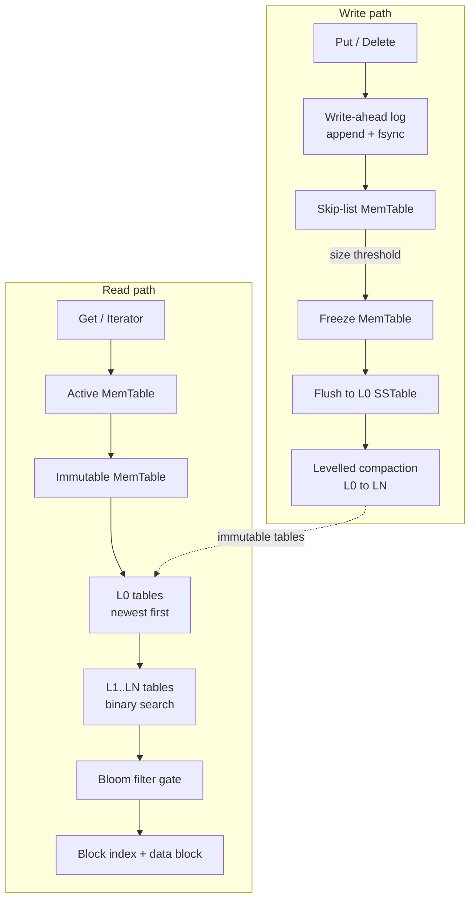

# lsmdb

A log-structured merge-tree storage engine in Go: write-ahead log, SSTables, bloom filters, levelled compaction and MVCC snapshots.

[](LICENSE)
[](go.mod)
[](https://github.com/sarmakska/lsmdb/commits/main)

lsmdb is an embedded, ordered key-value storage engine built on a log-structured
merge-tree, written in Go with the standard library only. It gives you durable
writes through a synced write-ahead log, fast reads through bloom-filtered
block-based SSTables, background space reclamation through levelled compaction,
and consistent point-in-time reads through MVCC snapshots. I built it to be the
kind of storage engine you can actually read end to end and trust, with every
hard part (recovery, the table format, the merging iterator and compaction)
implemented for real and covered by tests.

## Architecture



## Quickstart

Five commands, based on the actual code in this repository.

```sh
git clone https://github.com/sarmakska/lsmdb.git && cd lsmdb   # 1. get the source
go build ./...                                                 # 2. build everything
go test ./...                                                  # 3. run the test suite
go run ./cmd/lsmdb-demo                                        # 4. run the end-to-end demo
go test -bench . -run '^$' -benchtime=2000x ./                 # 5. run the benchmarks
```

Using the engine from your own code:

```go
package main

import (
	"fmt"
	"log"

	"github.com/sarmakska/lsmdb"
)

func main() {
	db, err := lsmdb.Open("./data", lsmdb.Options{})
	if err != nil {
		log.Fatal(err)
	}
	defer db.Close()

	if err := db.Put([]byte("greeting"), []byte("hello")); err != nil {
		log.Fatal(err)
	}

	// Snapshots give a stable, point-in-time view.
	snap := db.Snapshot()
	_ = db.Put([]byte("greeting"), []byte("updated"))

	live, _ := db.Get([]byte("greeting"))
	frozen, _ := snap.Get([]byte("greeting"))
	fmt.Printf("live=%s snapshot=%s\n", live, frozen) // live=updated snapshot=hello

	// Ordered range scan.
	it := db.NewIterator()
	for it.SeekToFirst(); it.Valid(); it.Next() {
		fmt.Printf("%s = %s\n", it.Key(), it.Value())
	}
}
```

## What is in the box

- **Skip-list MemTable** keyed by versioned internal keys, the in-memory write
  buffer (`internal/skiplist`, `internal/memtable`).
- **Write-ahead log** with CRC-checked, length-prefixed records and crash
  recovery that drops a torn trailing write (`internal/wal`).
- **Block-based SSTable format** with a sparse block index, a per-table bloom
  filter, and a properties block for cheap key bounds and counts
  (`internal/sstable`).
- **Levelled compaction** from L0 to LN with overlap-driven merges, newest
  version selection and bottom-level tombstone dropping (`compaction.go`).
- **MVCC** via monotonic sequence numbers, snapshot reads, and a heap-based
  merging iterator for ordered range scans across every level
  (`iterator.go`, `public_iterator.go`).
- **An append-only manifest** that records the live table set durably so the
  level layout survives a restart (`manifest.go`).
- A command-line demo (`cmd/lsmdb-demo`) and a runnable `Example` test.

## When to use this, and when not to

Use lsmdb when you want an embedded, single-process, ordered key-value store
with durable writes and snapshot reads, and you value a codebase you can read
and reason about. It suits write-heavy workloads, append-mostly logs, indexes,
and anything that benefits from sorted iteration.

Do not use lsmdb when you need a networked multi-node database, transactions
spanning multiple keys with strict serialisability, or the raw throughput and
maturity of a production engine such as RocksDB or Pebble. It is a focused,
correct, well-tested engine and a portfolio piece, not a drop-in replacement for
those systems.

## Benchmarks

Measured on an Apple M3 Pro with Go 1.26. Writes fsync the write-ahead log on
every Put, which is the honest cost of a crash-safe write and is dominated by
device fsync latency. Reads are served from memory or from bloom-filtered
SSTables. Reproduce with command 5 in the quickstart.

| Benchmark              | Result        | What it measures                              |
| ---------------------- | ------------- | --------------------------------------------- |
| `BenchmarkPutSync`     | ~2.65 ms/op   | Durable write throughput (append plus fsync)  |
| `BenchmarkGetMemTable` | ~95 us/op     | Point reads served from the MemTable          |
| `BenchmarkGetSSTable`  | ~6.2 us/op    | Point reads through the bloom filter and index |

The PutSync figure is fsync-bound: it reflects the cost of making each write
durable on the device, not the engine's in-memory work. Batching writes behind a
single fsync, which the WAL design already supports, lifts durable write
throughput by orders of magnitude when an application can tolerate it. The
SSTable read at ~6.2 us shows the bloom filter and sparse index doing their job:
a point read touches one filter, one index search and one block.

The bloom filter holds the observed false positive rate under three percent for
a one percent target across twenty thousand probes, verified in
`internal/bloom/bloom_test.go`.

## Documentation

The wiki covers the design in depth: the
[Architecture](https://github.com/sarmakska/lsmdb/wiki/Architecture),
[Write-Path](https://github.com/sarmakska/lsmdb/wiki/Write-Path),
[Read-Path](https://github.com/sarmakska/lsmdb/wiki/Read-Path),
[SSTable-Format](https://github.com/sarmakska/lsmdb/wiki/SSTable-Format),
[Compaction](https://github.com/sarmakska/lsmdb/wiki/Compaction),
[Recovery](https://github.com/sarmakska/lsmdb/wiki/Recovery) and
[Troubleshooting](https://github.com/sarmakska/lsmdb/wiki/Troubleshooting)
pages. Start at the [Home](https://github.com/sarmakska/lsmdb/wiki) page.

## License

MIT, copyright 2026 Sarma. See [LICENSE](LICENSE).
