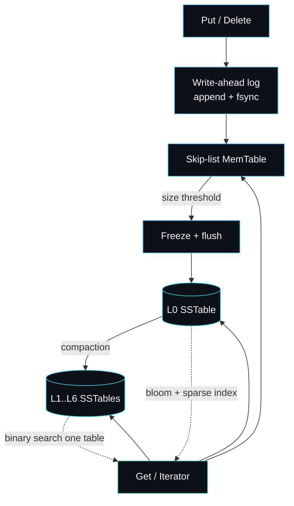
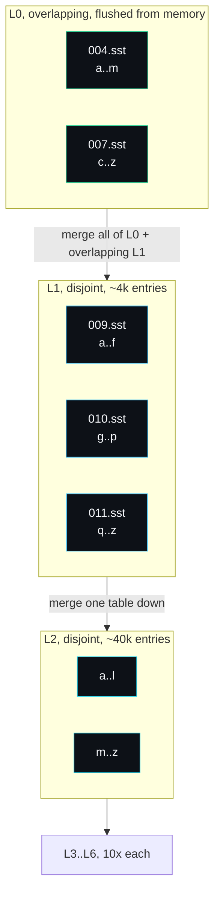

<p align="center"></p>

# lsmdb

A log-structured merge-tree storage engine in Go: write-ahead log, SSTables, bloom filters, levelled compaction and MVCC snapshots.

[](LICENSE)
[](go.mod)
[](https://github.com/sarmakska/lsmdb/commits/main)

```go
db, _ := lsmdb.Open("./data", lsmdb.Options{})
db.Put([]byte("greeting"), []byte("hello"))
snap := db.Snapshot()                 // freeze a view of the world
db.Put([]byte("greeting"), []byte("updated"))

live, _ := db.Get([]byte("greeting"))   // updated
old, _ := snap.Get([]byte("greeting"))  // hello
```

That snapshot still reads `hello` after the overwrite, and it will keep reading `hello` until you drop it. The whole engine is built to make that small guarantee true through a crash: every write is on disk before `Put` returns, and a process that dies mid-write recovers to a clean, consistent state with the torn tail dropped. The rest of this README is about how it does that and where it deliberately stops short.

## Why I built this

I have read the LevelDB and RocksDB source more times than I can count, and every time I came away with the same feeling: I understood the diagram but not the code. The papers explain the idea of an LSM-tree in a page; the production engines bury that idea under twenty years of flags, formats and compaction strategies. I wanted one I could hold in my head, where I could point at the exact lines that make a write durable, that decide which table a read touches, that drop a tombstone at the right moment and not a moment sooner.

So I wrote lsmdb top to bottom with the Go standard library and nothing else. Every hard part is implemented for real: the write-ahead log with CRC framing and torn-tail recovery, the block-based table format with a sparse index and a per-table bloom filter, the heap-based merging iterator, levelled compaction with correct tombstone handling, and MVCC snapshots over monotonic sequence numbers. No part is faked or stubbed. It is a portfolio engine and a teaching engine, not a RocksDB replacement, and I have tried to be honest about that line throughout.

## The shape of it



A write appends to the log, fsyncs, then lands in an in-memory skip list. When that fills, it freezes into an immutable L0 table on disk. Compaction merges tables down a hierarchy of levels in the background, throwing away superseded versions and spent tombstones. A read walks the sources newest first and stops at the first one that has any version of the key.

## The level hierarchy

The distinctive thing about an LSM-tree is the level layout, so it is worth seeing it directly. L0 holds whole MemTable snapshots that can overlap each other in key range. Everything below L0 is kept disjoint, and each level is ten times larger than the one above.



Because L0 overlaps, a read scans every L0 table newest first. Because L1 and below are disjoint, a read binary searches the level and touches at most one table. That asymmetry is the entire reason compaction exists: it turns the cheap, overlapping writes at the top into the cheap, single-table reads at the bottom. The policy lives in `pickCompaction` and the merge in `runCompaction`, both in `compaction.go`.

## Crash and recover, end to end

The durability contract is the part I most wanted to be able to point at. Here it is as a walkthrough you can run yourself. Save this as `crash_test.go` in the repo root and run `go test -run TestCrashWalkthrough -v ./`.

```go
package lsmdb

import "testing"

func TestCrashWalkthrough(t *testing.T) {
	dir := t.TempDir()

	// Session one: write a committed key, then "crash" by abandoning the
	// handle without Close, so nothing flushes and only the synced WAL remains.
	db, err := Open(dir, Options{})
	if err != nil {
		t.Fatal(err)
	}
	if err := db.Put([]byte("committed"), []byte("survives")); err != nil {
		t.Fatal(err)
	}
	// No db.Close(). The process is gone. The MemTable is lost; the WAL is not.

	// Session two: reopen. Recovery replays the synced WAL.
	db2, err := Open(dir, Options{})
	if err != nil {
		t.Fatal(err)
	}
	defer db2.Close()

	got, err := db2.Get([]byte("committed"))
	if err != nil || string(got) != "survives" {
		t.Fatalf("committed write did not survive the crash: %q %v", got, err)
	}
	if _, err := db2.Get([]byte("never-written")); err != ErrNotFound {
		t.Fatalf("a key that was never written came back: %v", err)
	}
}
```

The committed key survives because `Put` fsynced its record to the write-ahead log before returning (`write` in `db.go`). On reopen, `recoverLog` replays that log back into the MemTable and flushes it to an L0 table. A write that was only half-written when the process died fails its CRC check and is dropped by the WAL reader, so an uncommitted record never resurrects. The shipped suite proves the durable half at scale: `TestDurabilityAndRecovery` writes two thousand keys, abandons the handle, reopens, and checks every committed key is back. `TestRecoveryDropsTornTail` proves the other half by appending garbage to a log and watching it get dropped.

## Build and run

```sh
git clone https://github.com/sarmakska/lsmdb.git
cd lsmdb
go build ./...
go test ./...
go run ./cmd/lsmdb-demo          # end-to-end demo
```

Using it as a library:

```go
db, err := lsmdb.Open("./data", lsmdb.Options{})
if err != nil {
	log.Fatal(err)
}
defer db.Close()

db.Put([]byte("k"), []byte("v"))

it := db.NewIterator()           // ordered range scan
for it.SeekToFirst(); it.Valid(); it.Next() {
	fmt.Printf("%s = %s\n", it.Key(), it.Value())
}
```

The public surface is seven methods: `Open`, `Close`, `Put`, `Delete`, `Get`, `NewIterator` and `Snapshot`. Everything under them is in this package and `internal/`.

## What is implemented

| Piece | Where | Notes |
| --- | --- | --- |
| Skip-list MemTable | `internal/skiplist`, `internal/memtable` | single writer, concurrent readers, MVCC-aware point lookup |
| Write-ahead log | `internal/wal` | CRC + length framing, torn-tail recovery |
| SSTable format | `internal/sstable` | sparse block index, bloom filter, properties block, 8-byte magic footer |
| Bloom filter | `internal/bloom` | double hashing, `m/n = -ln(p)/ln(2)^2` sizing |
| Levelled compaction | `compaction.go` | overlap-driven merges, newest-wins, bottom-level tombstone drop |
| Merging iterator | `iterator.go` | min-heap over every sorted source |
| MVCC + snapshots | `public_iterator.go`, `internal/encoding` | 56-bit sequence in the internal-key trailer |
| Manifest | `manifest.go` | append-only edit log, the atomic commit point |

## Benchmarks

Measured on an Apple M3 Pro, Go 1.26.3, with `go test -bench . -run '^$' -benchtime=2000x ./`. These are the numbers that command printed on my machine, nothing rounded for effect.

| Benchmark | Result | What it measures |
| --- | --- | --- |
| `BenchmarkPutSync` | 2.82 ms/op | durable write: WAL append plus fsync |
| `BenchmarkGetMemTable` | 10.6 us/op | point read served from the MemTable |
| `BenchmarkGetSSTable` | 2.15 us/op | point read through the bloom filter and block index |

The PutSync figure is fsync-bound, not engine-bound: it is the cost of forcing one record to durable storage on this laptop, dominated by the device's fsync latency. The WAL keeps `Append` and `Sync` as separate calls precisely so an application that can tolerate a few milliseconds of loss on a crash can batch many writes behind one fsync and lift that number by orders of magnitude. The SSTable read at 2.15 us shows the bloom filter and sparse index earning their place: a point read touches one filter, one binary search and one block. `internal/bloom/bloom_test.go` holds the observed false-positive rate within bounds of the one-percent target across twenty thousand probes.

## Design decisions

A few choices where I picked one road and walked away from another:

**A skip list for the MemTable, not a B-tree or a sorted slice.** A sorted slice is the obvious first idea and it iterates beautifully, but every insert is O(n) to shift, which is fatal for a write buffer. A balanced B-tree gives the right complexity but the rebalancing makes lock-free concurrent reads hard. A skip list gives logarithmic insert and search with a structure where a reader can walk forward while a single writer appends, which is exactly the access pattern here.

**An append-only manifest, not a rewritten snapshot file.** I considered writing the full live table set to a fresh file on every change and renaming it into place. That is simpler to read back, but each compaction would rewrite the whole list, and a rename is not the only thing that has to be atomic. The version-edit log that LevelDB and RocksDB use turned out to be both smaller per change and the natural place to make the compaction swap atomic: one fsynced edit both adds the outputs and deletes the inputs. I kept it as newline-delimited JSON so you can `cat` the manifest and read the history.

**Inline flush and compaction under the write lock, not a background goroutine.** The textbook design runs compaction on its own goroutine so writers never block. I deliberately did not, at least not yet. Running flush and compaction inline under the lock makes the durability and recovery semantics trivial to reason about and to test: there is no concurrent mutation of the level layout to race against, so every test is deterministic. The cost is that a flush or compaction briefly stalls writers. The manifest design already supports moving this to the background, and that is the first thing I would change for a real workload. I chose correctness I could prove over throughput I could not.

**Whole keys in data blocks, not prefix compression.** LevelDB prefix-compresses keys within a block to save space. I store keys whole. It costs disk, but it keeps the block reader a straight scan with no restart-point bookkeeping, and the format stays something you can describe in a paragraph. Prefix compression would not touch the index or footer, so it is a clean later addition if the space ever matters.

## Limitations and non-goals

This is a single-process embedded engine. It is not, and will not become:

- A networked or multi-node database. No replication, no sharding, no server. If you want a distributed key-value store, that is a different project (I have one: see raftkv in the family below).
- A transaction manager. There is no multi-key atomic commit and no serialisable isolation across keys. Snapshots give you a consistent read view; they do not give you read-modify-write transactions.
- A drop-in for RocksDB or Pebble. Those are battle-tested over years across thousands of deployments. lsmdb is correct and well tested, but it has not survived production, and I will not pretend otherwise.

Snapshots also do not pin storage: the engine keeps old versions only until compaction reclaims them, so a snapshot held across heavy write volume can lose the versions it needed. Keep snapshots short, or bound writes while one is open. Snapshot pinning is a known, designed-for extension, not a thing that exists today.

## Roadmap

What I intend to add, roughly in order:

- Batched writes behind a single fsync, exposed as a `WriteBatch`, for applications that can trade a little durability for a lot of throughput.
- Background flush and compaction on a dedicated goroutine, once I have a concurrency test harness I trust to catch a regression in the recovery semantics.
- Snapshot pinning: a retained minimum sequence that compaction must not drop below.
- An orphaned-file sweep on open to remove unreferenced `.sst` files left by a crash mid-compaction.

What I will not add: a network layer, a query language, or pluggable comparators. They would each pull the project away from being a readable single-purpose engine, which is the whole point.

## Documentation

The wiki goes deep on each subsystem with real code references:
[Home](https://github.com/sarmakska/lsmdb/wiki) .
[Architecture](https://github.com/sarmakska/lsmdb/wiki/Architecture) .
[Write-Path](https://github.com/sarmakska/lsmdb/wiki/Write-Path) .
[Read-Path](https://github.com/sarmakska/lsmdb/wiki/Read-Path) .
[SSTable-Format](https://github.com/sarmakska/lsmdb/wiki/SSTable-Format) .
[Compaction](https://github.com/sarmakska/lsmdb/wiki/Compaction) .
[Recovery](https://github.com/sarmakska/lsmdb/wiki/Recovery) .
[Roadmap-and-Limitations](https://github.com/sarmakska/lsmdb/wiki/Roadmap-and-Limitations) .
[Troubleshooting](https://github.com/sarmakska/lsmdb/wiki/Troubleshooting)

## License

MIT, copyright 2026 Sarma. See [LICENSE](LICENSE).

---
Built by Sarma. Part of the SarmaLinux open-source line.
Website: https://sarmalinux.com  .  GitHub: https://github.com/sarmakska
