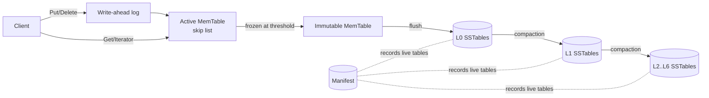
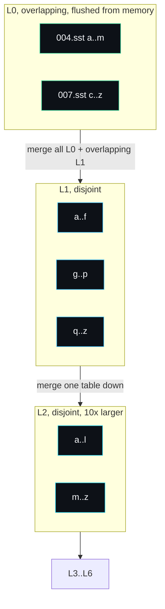

# Architecture

lsmdb is a log-structured merge-tree. The central idea of an LSM-tree is that
writes are cheap because they only ever append: to a log, then to memory, then
to immutable sorted files. The cost of that cheap write is paid later, in the
background, by compaction, which keeps read amplification bounded by merging
files down a hierarchy of levels. This page describes the components and the
invariants that connect them.

## Components



### MemTable

The MemTable is the in-memory write buffer. It is a skip list
(`internal/skiplist/skiplist.go`) keyed by internal keys. A skip list gives
logarithmic search and insert with simple reads, which suits a buffer where one
writer appends under a lock and readers scan concurrently. The MemTable wrapper
(`internal/memtable/memtable.go`) adds the MVCC-aware point lookup.

### Write-ahead log

Every mutation is appended to the write-ahead log and fsynced before the write
is acknowledged (`internal/wal/wal.go`). The log makes a write durable before it
exists anywhere except memory, so a crash cannot lose an acknowledged write.

### SSTables

When the MemTable reaches its size threshold it is frozen and flushed to an
immutable sorted table, an SSTable (`internal/sstable`). Tables are organised
into levels. Level 0 holds tables flushed directly from MemTables, so they can
overlap in key range. Levels 1 and below hold non-overlapping tables, so at most
one table per level can contain any given key.



The fixed depth is seven levels (`numLevels` in `db.go`). A read scans all of L0
newest first because the tables overlap, then binary searches each disjoint
level below and touches at most one table per level.

### Manifest

The set of live tables and their level assignment is recorded in an append-only
manifest (`manifest.go`). Each change (a flush or a compaction) appends a durable
edit. On open the engine replays the manifest to reconstruct the level layout.

## The internal key

MVCC rests on the internal key layout (`internal/encoding/encoding.go`). Every
user key is stored with an 8-byte trailer that packs a 56-bit sequence number
and an 8-bit value kind:

```
+------------------+--------------------------+
| user key bytes   | seq (56 bits) | kind 8b  |
+------------------+--------------------------+
```

The trailer is stored big-endian and compared so that, within one user key, a
larger sequence number sorts first. That single ordering rule is what makes
everything else work: an iterator seeking a key lands on its newest version, a
merge keeps the first occurrence of each user key, and a snapshot read skips
versions newer than its sequence.

## Invariants

These properties hold at all times and the tests check them:

1. **Durability.** A Put or Delete that returns nil has been fsynced to the
   write-ahead log. Recovery replays it.
2. **Sequence monotonicity.** Sequence numbers increase by one per write and
   never repeat, so versions of a key totally order by recency.
3. **Level disjointness below L0.** For levels 1 and deeper, table key ranges do
   not overlap. This lets a read binary search a level and read at most one
   table.
4. **Newest wins.** For any user key, the version with the highest sequence at
   or below the read snapshot decides the result. A tombstone at that position
   means the key is absent.
5. **Compaction preserves visible state.** Merging tables never changes what a
   reader at the latest sequence observes; it only discards versions that no
   reader can observe.

## Concurrency model

The engine takes a single `sync.RWMutex`. Writes take the write lock; reads take
the read lock. SSTables are immutable once written, and the MemTable skip list
supports concurrent reads with a single writer, so a reader holding the read
lock sees a stable view. Flush and compaction run inline under the write lock,
which keeps the durability and recovery semantics straightforward to reason
about and to test. The trade-off is that a flush or compaction briefly blocks
writers; a production engine would move these to a background goroutine, and the
manifest design already supports that evolution.

## Design decisions and rejected alternatives

The choices that shaped the engine, and what I turned down:

**Skip-list MemTable over a sorted slice or a B-tree.** A sorted slice iterates
beautifully but inserts in O(n), which is fatal for a write buffer. A B-tree has
the right complexity but its rebalancing makes lock-free concurrent reads hard.
A skip list gives logarithmic insert and search while letting readers walk
forward as a single writer appends, which is exactly the access pattern here.

**Append-only manifest over a rewritten snapshot file.** Writing the whole live
table set to a fresh file and renaming it in is simpler to read back, but every
compaction would rewrite the entire list. The version-edit log that LevelDB and
RocksDB use is smaller per change and is the natural atomic commit point: one
fsynced edit both adds the compaction outputs and deletes its inputs. Kept as
newline-delimited JSON so the manifest is inspectable with `cat`.

**Inline flush and compaction over a background goroutine.** Running them inline
under the write lock makes the durability and recovery semantics deterministic
and trivial to test: nothing races the level layout. The cost is that a flush or
compaction briefly stalls writers. The manifest design already supports moving
this to a background goroutine, which is the first change a real workload needs.

**Whole keys in data blocks over prefix compression.** Prefix compression saves
disk but adds restart-point bookkeeping to the block reader. Storing keys whole
keeps the reader a straight scan and the format describable in a paragraph.
Prefix compression touches neither the index nor the footer, so it stays a clean
later addition.

## Further reading

- [Write-Path](Write-Path) for the life of a write.
- [Read-Path](Read-Path) for the life of a read and MVCC.
- [SSTable-Format](SSTable-Format) for the on-disk layout.
- [Compaction](Compaction) for the merge policy.
- [Recovery](Recovery) for restart and crash handling.
- [Roadmap and Limitations](Roadmap-and-Limitations) for what is not here.

---
SarmaLinux . sarmalinux.com . [lsmdb on GitHub](https://github.com/sarmakska/lsmdb)
