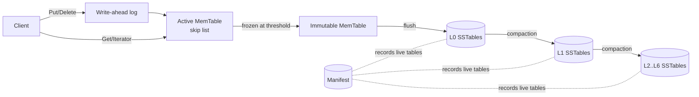

# Architecture

lsmdb is a log-structured merge-tree. The central idea of an LSM-tree is that
writes are cheap because they only ever append: to a log, then to memory, then
to immutable sorted files. The cost of that cheap write is paid later, in the
background, by compaction, which keeps read amplification bounded by merging
files down a hierarchy of levels. This page describes the components and the
invariants that connect them.

## Components



### MemTable

The MemTable is the in-memory write buffer. It is a skip list
(`internal/skiplist/skiplist.go`) keyed by internal keys. A skip list gives
logarithmic search and insert with simple reads, which suits a buffer where one
writer appends under a lock and readers scan concurrently. The MemTable wrapper
(`internal/memtable/memtable.go`) adds the MVCC-aware point lookup.

### Write-ahead log

Every mutation is appended to the write-ahead log and fsynced before the write
is acknowledged (`internal/wal/wal.go`). The log makes a write durable before it
exists anywhere except memory, so a crash cannot lose an acknowledged write.

### SSTables

When the MemTable reaches its size threshold it is frozen and flushed to an
immutable sorted table, an SSTable (`internal/sstable`). Tables are organised
into levels. Level 0 holds tables flushed directly from MemTables, so they can
overlap in key range. Levels 1 and below hold non-overlapping tables, so at most
one table per level can contain any given key.

### Manifest

The set of live tables and their level assignment is recorded in an append-only
manifest (`manifest.go`). Each change (a flush or a compaction) appends a durable
edit. On open the engine replays the manifest to reconstruct the level layout.

## The internal key

MVCC rests on the internal key layout (`internal/encoding/encoding.go`). Every
user key is stored with an 8-byte trailer that packs a 56-bit sequence number
and an 8-bit value kind:

```
+------------------+--------------------------+
| user key bytes   | seq (56 bits) | kind 8b  |
+------------------+--------------------------+
```

The trailer is stored big-endian and compared so that, within one user key, a
larger sequence number sorts first. That single ordering rule is what makes
everything else work: an iterator seeking a key lands on its newest version, a
merge keeps the first occurrence of each user key, and a snapshot read skips
versions newer than its sequence.

## Invariants

These properties hold at all times and the tests check them:

1. **Durability.** A Put or Delete that returns nil has been fsynced to the
   write-ahead log. Recovery replays it.
2. **Sequence monotonicity.** Sequence numbers increase by one per write and
   never repeat, so versions of a key totally order by recency.
3. **Level disjointness below L0.** For levels 1 and deeper, table key ranges do
   not overlap. This lets a read binary search a level and read at most one
   table.
4. **Newest wins.** For any user key, the version with the highest sequence at
   or below the read snapshot decides the result. A tombstone at that position
   means the key is absent.
5. **Compaction preserves visible state.** Merging tables never changes what a
   reader at the latest sequence observes; it only discards versions that no
   reader can observe.

## Concurrency model

The engine takes a single `sync.RWMutex`. Writes take the write lock; reads take
the read lock. SSTables are immutable once written, and the MemTable skip list
supports concurrent reads with a single writer, so a reader holding the read
lock sees a stable view. Flush and compaction run inline under the write lock,
which keeps the durability and recovery semantics straightforward to reason
about and to test. The trade-off is that a flush or compaction briefly blocks
writers; a production engine would move these to a background goroutine, and the
manifest design already supports that evolution.

## Further reading

- [Write-Path](Write-Path) for the life of a write.
- [Read-Path](Read-Path) for the life of a read and MVCC.
- [SSTable-Format](SSTable-Format) for the on-disk layout.
- [Compaction](Compaction) for the merge policy.
- [Recovery](Recovery) for restart and crash handling.
