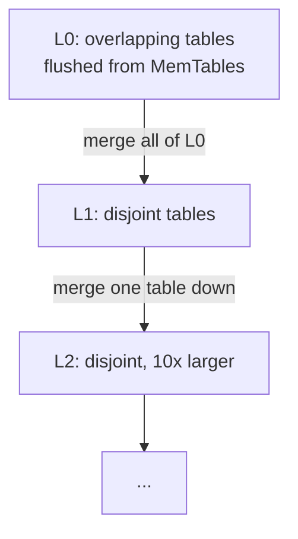

# Compaction

Compaction is the background work that pays for cheap writes. It merges
overlapping tables down the level hierarchy, discards versions that no reader can
observe, and drops tombstones once they have done their job. Without compaction
an LSM-tree would accumulate tables without bound and reads would slow as they
consulted more and more files. The code is `compaction.go`.

## Why levels

Level 0 tables are flushed straight from MemTables, so they can overlap in key
range. Levels 1 and below are kept disjoint: within a level, no two tables share
a key. Disjoint levels let a read binary search a level and touch at most one
table, which bounds read amplification. Each level is also larger than the one
above by `LevelSizeMultiplier` (ten by default), so the tree is shallow even for
large datasets.



## When compaction runs

`maybeCompactLocked` runs after every MemTable flush and keeps compacting until
there is no more work:

```go
for {
    level, inputs, ok := db.pickCompaction()
    if !ok {
        return nil
    }
    if err := db.runCompaction(level, inputs); err != nil {
        return err
    }
}
```

`pickCompaction` chooses the work:

- **L0 to L1** triggers on table count. When L0 has at least
  `L0CompactionTrigger` tables (four by default), all of L0 is merged with the
  overlapping L1 tables. L0 is triggered by count because its tables overlap, so
  the more there are the more tables a read must scan.
- **Level N to N+1** triggers on size budget, approximated by entry count. When a
  level exceeds its budget, the first table of that level is merged with the
  overlapping tables of the next level down.

## Picking inputs

For an L0 compaction the inputs are all of L0 plus every L1 table that overlaps
the combined key range of L0:

```go
inputs = append(inputs, db.levels[0]...)
smallest, largest := keyRange(inputs)
inputs = append(inputs, db.overlapping(1, smallest, largest)...)
```

`overlapping` selects tables whose user-key range intersects the target range:

```go
if encoding.CompareBytes(tableLargest, rangeSmallest) < 0 ||
   encoding.CompareBytes(tableSmallest, rangeLargest) > 0 {
    continue // disjoint, skip
}
```

This overlap-driven selection is what keeps levels disjoint after the merge: any
existing table that could collide with the output is pulled into the merge and
rewritten.

## The merge

`runCompaction` feeds the input tables into a merging iterator, which yields
internal keys in global sorted order, newest version of each user key first. It
walks that stream and writes the survivors to one or more output tables on the
target level:

```go
for ; merged.Valid(); merged.Next() {
    key := merged.Key()
    uk := key.UserKey()

    // Keep only the newest version of each user key.
    if haveLast && encoding.CompareBytes(uk, lastUserKey) == 0 {
        continue
    }
    lastUserKey = append(lastUserKey[:0], uk...)
    haveLast = true

    // Drop a tombstone once we reach the bottom level.
    if key.Kind() == encoding.KindDelete && isBottom {
        continue
    }

    writer.Add(key, merged.Value())
}
```

Two rules govern what survives:

1. **Newest version wins.** Because the merging iterator yields the newest
   version of a user key first, every later entry with the same user key is an
   older version and is dropped. This is where space is reclaimed: overwrites and
   stale versions disappear.
2. **Tombstones drop at the bottom.** A deletion tombstone is kept until it
   reaches the bottom level, because above the bottom there may still be an older
   live version in a deeper level that the tombstone must continue to shadow. At
   the bottom there is nothing below it, so the tombstone has done its job and is
   discarded along with the key it was hiding.

Output is split into a new table once a writer reaches `compactionMaxEntries`,
which keeps individual tables bounded so they can be compacted again later.

## Atomic swap and space reclamation

The new tables replace the inputs atomically through the manifest. The engine
writes a single manifest edit that both adds the outputs and deletes the inputs,
and fsyncs it before deleting any input file:

```go
db.manifest.append(manifestEdit{
    Added:   added,
    Deleted: deleted,
    ...
})
db.removeTables(srcLevel, inputs)
db.removeTables(targetLevel, inputs)
for _, t := range inputs {
    os.Remove(t.Path())
}
```

If the process crashes after the edit is durable but before the files are
deleted, the next open replays the manifest, sees the inputs as deleted, and the
orphaned files are simply unreferenced. If it crashes before the edit is durable,
the old tables are still live and the half-written outputs are unreferenced. In
both cases the database stays consistent.

The `TestCompactionCorrectnessAndReclamation` test writes each key three times,
deletes a quarter of the keys, then reopens and checks that every live key reads
its newest value, every deleted key is gone, and the total live entry count is
far below the raw number of writes, proving superseded versions were reclaimed.

## See also

- [SSTable-Format](SSTable-Format) for the tables being merged.
- [Read-Path](Read-Path) for why disjoint levels make reads cheap.
- [Recovery](Recovery) for the manifest and the atomic swap on restart.
