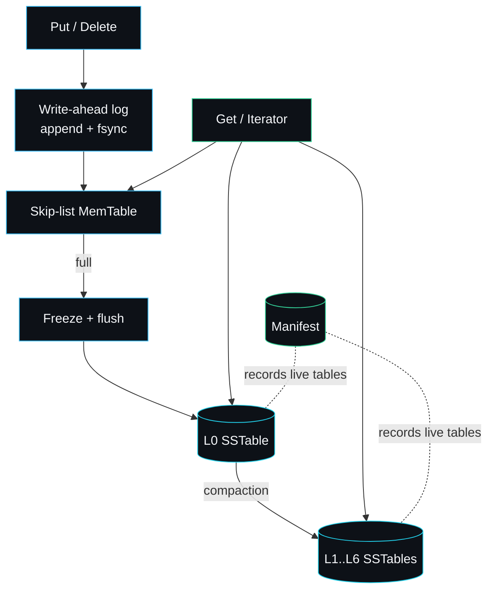

# lsmdb

A log-structured merge-tree storage engine in Go: write-ahead log, SSTables,
bloom filters, levelled compaction and MVCC snapshots. Standard library only,
no external dependencies.

This is the full design documentation for lsmdb. It is written for an engineer
who wants to understand how the engine works, integrate it, tune it, or extend
it. Every page references the actual source by file and symbol, so you can move
between the prose and the code without guessing.

## Thirty-second orientation

A write goes to a log, then to memory, then to a sorted file on disk. Reads walk
those sources newest first. A background merge keeps the files tidy. That is the
whole engine in one diagram:



## The public API in one block

```go
db, err := lsmdb.Open(dir, lsmdb.Options{})
err = db.Put(key, value)
err = db.Delete(key)
value, err := db.Get(key)
it := db.NewIterator()        // ordered range scan
snap := db.Snapshot()         // point-in-time view
err = db.Close()
```

Seven methods on `*DB`, plus `Get` and `NewIterator` on `*Snapshot`. Everything
below those is in this package and the `internal/` tree. The full signatures and
semantics are in [API-Reference](API-Reference).

## Where to go next

| If you want to... | Read |
| --- | --- |
| See the components and invariants | [Architecture](Architecture) |
| Follow a write to durable disk | [Write-Path](Write-Path) |
| Follow a read and understand MVCC | [Read-Path](Read-Path) |
| Understand the in-memory buffer | [Skip-List-and-MemTable](Skip-List-and-MemTable) |
| Understand durability framing | [Write-Ahead-Log](Write-Ahead-Log) |
| Understand the on-disk table | [SSTable-Format](SSTable-Format) |
| Understand the membership filter | [Bloom-Filter](Bloom-Filter) |
| Learn the merge policy | [Compaction](Compaction) |
| See how the live table set is tracked | [Manifest-and-Versioning](Manifest-and-Versioning) |
| Understand versioned keys | [Internal-Key-and-MVCC](Internal-Key-and-MVCC) |
| See how sorted streams are combined | [Merging-Iterator](Merging-Iterator) |
| Read the full method reference | [API-Reference](API-Reference) |
| Tune the options for your workload | [Configuration-and-Tuning](Configuration-and-Tuning) |
| Read every byte layout | [Data-Formats](Data-Formats) |
| See crash and restart in detail | [Recovery](Recovery) |
| See real numbers from real hardware | [Performance-and-Benchmarks](Performance-and-Benchmarks) |
| Fix a symptom you are hitting | [Troubleshooting](Troubleshooting) |
| Understand why it is built this way | [Design-Decisions](Design-Decisions) |
| Compare it to LevelDB, Pebble, BoltDB | [Comparisons](Comparisons) |
| See how it is tested | [Testing-Strategy](Testing-Strategy) |
| Copy a working recipe | [Examples-and-Recipes](Examples-and-Recipes) |
| Add a feature without breaking it | [Writing-an-Extension](Writing-an-Extension) |
| Get a quick answer | [FAQ](FAQ) |
| Know what is and is not coming | [Roadmap-and-Limitations](Roadmap-and-Limitations) |

## What lsmdb is

lsmdb is an embedded, ordered key-value storage engine. It stores sorted keys,
gives you durable writes, lets you read a consistent point-in-time snapshot, and
reclaims space in the background through compaction. It is a single-process
library you link into a Go program, not a server.

It is deliberately small and readable: every hard part of an LSM-tree is
implemented for real (CRC-framed WAL with torn-tail recovery, a block-based
table with a sparse index and a per-table bloom filter, a heap-based merging
iterator, levelled compaction with correct tombstone handling, MVCC over
monotonic sequence numbers) and nothing is faked or stubbed. It is a portfolio
and teaching engine, not a RocksDB replacement, and the docs are honest about
that line. See [Roadmap-and-Limitations](Roadmap-and-Limitations) and
[Comparisons](Comparisons).

## How the pieces fit together

A write is appended to the [write-ahead log](Write-Ahead-Log) and synced, then
added to an in-memory [skip-list MemTable](Skip-List-and-MemTable). When the
MemTable fills it is frozen and flushed to an immutable [SSTable](SSTable-Format)
in level 0. A read consults the MemTable first, then each level, using
[bloom filters](Bloom-Filter) to skip tables that cannot hold the key.
[Compaction](Compaction) merges overlapping tables down the level hierarchy,
discarding superseded versions and tombstones to reclaim space. The
[manifest](Manifest-and-Versioning) records which tables are live.
[MVCC](Internal-Key-and-MVCC) sequence numbers make snapshots and ordered scans
consistent.

## Source layout

| Path                      | Responsibility                                  | Wiki page |
| ------------------------- | ----------------------------------------------- | --- |
| `db.go`                   | Engine lifecycle, Put/Delete/Get, flush, levels | [Architecture](Architecture) |
| `compaction.go`           | Compaction policy and the merge itself          | [Compaction](Compaction) |
| `iterator.go`             | Heap-based merging iterator over sorted sources | [Merging-Iterator](Merging-Iterator) |
| `public_iterator.go`      | Public range iterator and Snapshot              | [Read-Path](Read-Path) |
| `manifest.go`             | Append-only manifest of the live table set      | [Manifest-and-Versioning](Manifest-and-Versioning) |
| `record.go`               | WAL record codec and helpers                    | [Data-Formats](Data-Formats) |
| `internal/skiplist`       | Concurrent-read skip list                       | [Skip-List-and-MemTable](Skip-List-and-MemTable) |
| `internal/memtable`       | MemTable over the skip list                     | [Skip-List-and-MemTable](Skip-List-and-MemTable) |
| `internal/wal`            | Write-ahead log writer and reader               | [Write-Ahead-Log](Write-Ahead-Log) |
| `internal/sstable`        | SSTable writer and reader                       | [SSTable-Format](SSTable-Format) |
| `internal/bloom`          | Bloom filter builder and filter                 | [Bloom-Filter](Bloom-Filter) |
| `internal/encoding`       | Internal key layout and comparators             | [Internal-Key-and-MVCC](Internal-Key-and-MVCC) |
| `cmd/lsmdb-demo`          | End-to-end smoke-test driver                    | [Examples-and-Recipes](Examples-and-Recipes) |

---
SarmaLinux . sarmalinux.com . [lsmdb on GitHub](https://github.com/sarmakska/lsmdb)
