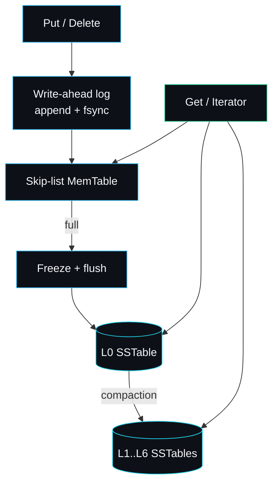

# lsmdb

A log-structured merge-tree storage engine in Go: write-ahead log, SSTables,
bloom filters, levelled compaction and MVCC snapshots.

This wiki is the design documentation for lsmdb. It is written for an engineer
who wants to understand how the engine works, integrate it, or extend it. Each
page references the actual source so you can move between the prose and the code
without guessing.

## Thirty-second orientation

A write goes to a log, then to memory, then to a sorted file on disk. Reads walk
those sources newest first. A background merge keeps the files tidy. That is the
whole engine in one diagram:



## Where to go next

| If you want to... | Read |
| --- | --- |
| See the components and invariants | [Architecture](Architecture) |
| Follow a write to durable disk | [Write-Path](Write-Path) |
| Follow a read and understand MVCC | [Read-Path](Read-Path) |
| Understand the on-disk table | [SSTable-Format](SSTable-Format) |
| Learn the merge policy | [Compaction](Compaction) |
| See crash and restart in detail | [Recovery](Recovery) |
| Know what is and is not coming | [Roadmap and Limitations](Roadmap-and-Limitations) |
| Fix a symptom you are hitting | [Troubleshooting](Troubleshooting) |

## What lsmdb is

lsmdb is an embedded, ordered key-value storage engine. It stores sorted keys,
gives you durable writes, lets you read a consistent point-in-time snapshot, and
reclaims space in the background through compaction. It is written in Go with
the standard library only and has no external dependencies.

The public API is deliberately small:

```go
db, err := lsmdb.Open(dir, lsmdb.Options{})
err = db.Put(key, value)
err = db.Delete(key)
value, err := db.Get(key)
it := db.NewIterator()        // ordered range scan
snap := db.Snapshot()         // point-in-time view
err = db.Close()
```

## How the pieces fit together

A write is appended to the [write-ahead log](Write-Path) and synced, then added
to an in-memory skip-list MemTable. When the MemTable fills it is frozen and
flushed to an immutable [SSTable](SSTable-Format) in level 0. A read consults
the MemTable first, then each level, using bloom filters to skip tables that
cannot hold the key. [Compaction](Compaction) merges overlapping tables down the
level hierarchy, discarding superseded versions and tombstones to reclaim space.
[MVCC](Read-Path) sequence numbers make snapshots and ordered scans consistent.

## Page index

- [Architecture](Architecture): the components, the data flow and the
  invariants that hold the system together.
- [Write-Path](Write-Path): how a Put becomes durable and how the MemTable
  rotates to disk.
- [Read-Path](Read-Path): how a Get resolves across the MemTable and levels, and
  how MVCC and snapshots work.
- [SSTable-Format](SSTable-Format): the on-disk table layout, the block index,
  the bloom filter and the properties block.
- [Compaction](Compaction): the compaction policy, overlap-driven merges,
  tombstone handling and space reclamation.
- [Recovery](Recovery): crash recovery, the manifest, and how a torn write is
  detected and dropped.
- [Roadmap and Limitations](Roadmap-and-Limitations): what I will and will not
  add, and what the engine is honestly not.
- [Troubleshooting](Troubleshooting): symptoms, causes and fixes.

## Source layout

| Path                      | Responsibility                                  |
| ------------------------- | ----------------------------------------------- |
| `db.go`                   | Engine lifecycle, Put/Delete/Get, flush, levels |
| `compaction.go`           | Compaction policy and the merge itself          |
| `iterator.go`             | Heap-based merging iterator over sorted sources |
| `public_iterator.go`      | Public range iterator and Snapshot              |
| `manifest.go`             | Append-only manifest of the live table set      |
| `record.go`               | WAL record codec and helpers                    |
| `internal/skiplist`       | Concurrent-read skip list                       |
| `internal/memtable`       | MemTable over the skip list                     |
| `internal/wal`            | Write-ahead log writer and reader               |
| `internal/sstable`        | SSTable writer and reader                       |
| `internal/bloom`          | Bloom filter builder and filter                 |
| `internal/encoding`       | Internal key layout and comparators             |

---
SarmaLinux . sarmalinux.com . [lsmdb on GitHub](https://github.com/sarmakska/lsmdb)
