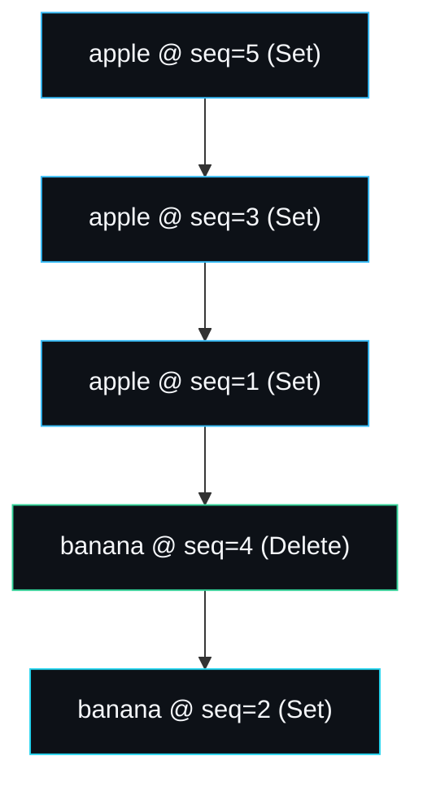

# Internal Key and MVCC

Multi-version concurrency control in lsmdb rests on one idea: every user key is
stored together with a monotonic sequence number, so that the same user key
written twice produces two distinct, totally ordered versions. That pairing is
the internal key, and a single comparison rule built on it makes snapshots,
overwrites, deletes and compaction all fall out for free. The code is
`internal/encoding/encoding.go`.

## The layout

An internal key is the user key bytes followed by an 8-byte trailer:

```
+------------------+-----------------------------+
| user key bytes   | seq (56 bits) | kind (8b)   |
+------------------+-----------------------------+
```

The trailer packs a 56-bit sequence number in the high bits and an 8-bit value
kind in the low bits:

```go
func PackTrailer(seq uint64, kind Kind) uint64 {
    return (seq << 8) | uint64(kind)
}

func MakeInternalKey(userKey []byte, seq uint64, kind Kind) InternalKey {
    ik := make([]byte, len(userKey)+8)
    copy(ik, userKey)
    binary.BigEndian.PutUint64(ik[len(userKey):], PackTrailer(seq, kind))
    return ik
}
```

The trailer is stored **big-endian**, which is the crucial detail: a plain
bytewise comparison of the trailer then orders by sequence first, kind second,
which is exactly what the comparator wants.

`Kind` has two values:

```go
const (
    KindDelete Kind = 0  // a tombstone
    KindSet    Kind = 1  // a live value
)
```

The 56-bit sequence space gives a maximum of 2^56 - 1 writes
(`MaxSequence`), about 72 quadrillion, which no single-process database will
exhaust.

## The comparison rule

`CompareInternal` is the one ordering that everything else depends on:

```go
func CompareInternal(a, b InternalKey) int {
    ua, ub := a.UserKey(), b.UserKey()
    if c := compareBytes(ua, ub); c != 0 {
        return c            // user keys ascending
    }
    ta, tb := a.Trailer(), b.Trailer()
    switch {
    case ta > tb: return -1 // larger trailer (newer) sorts FIRST
    case ta < tb: return 1
    default:      return 0
    }
}
```

Two rules in one function:

1. **User keys ascending.** Different user keys order in plain byte order, which
   is what a range scan walks.
2. **Within a user key, newer first.** A larger trailer means a larger sequence,
   and it sorts ahead. So an iterator that seeks a user key lands on its newest
   version, and a merge that keeps the first occurrence of each user key keeps the
   newest.



That is the sorted order of five versions of two keys. A reader seeking `apple`
at the latest sequence lands on `apple @ 5`. A reader seeking `banana` lands on
the tombstone `banana @ 4` and stops, reporting the key absent.

## Reading the parts back

The accessors decode the trailer:

```go
func (ik InternalKey) UserKey() []byte { return ik[:len(ik)-8] }
func (ik InternalKey) Trailer() uint64 { return binary.BigEndian.Uint64(ik[len(ik)-8:]) }
func (ik InternalKey) Sequence() uint64 { return ik.Trailer() >> 8 }
func (ik InternalKey) Kind() Kind { return Kind(ik.Trailer() & 0xff) }
```

A short key (under 8 bytes) returns nil or zero rather than panicking, so a
malformed key degrades safely.

## How snapshots use the sequence

A [snapshot](Read-Path) is just a captured sequence number. A read at snapshot
`S` seeks the internal key built at `(userKey, S, KindSet)`. Because higher
sequences sort first, the seek skips every version newer than `S` and lands on
the newest version at or below `S`. Two snapshots taken at different times read
two consistent views, even as writes continue. There is no copy, no lock held for
the life of the snapshot, just a number compared against each key's sequence.

The seek key always uses `KindSet`, not the real kind, because within a user key
the kind is the low byte of the trailer and `KindSet` (1) sorts after
`KindDelete` (0) for the same sequence. Using `KindSet` in the seek means a
search for a key at sequence `S` will not skip past a tombstone written at exactly
`S`. In practice each write gets a unique sequence, so this is a correctness
edge case rather than a hot path.

## How compaction uses the sequence

A [compaction](Compaction) merge yields the newest version of each user key
first. It keeps that one and drops the rest, which is where overwrites are
reclaimed. A tombstone is kept until the bottom level, where nothing older can
exist, then dropped along with the key it shadowed. None of this needs the user
key's value; it is all driven by the trailer ordering.

## Why big-endian, and why the trailer descends

Two design choices make a single `compareBytes` on the trailer do the right
thing. Big-endian storage means the most significant byte of the sequence is
compared first, so bytewise order equals numeric order. The comparator then
inverts the trailer comparison so that the numerically larger (newer) trailer is
treated as "less" and sorts first. The alternative, storing the sequence
little-endian and special-casing the comparison, would work but would lose the
property that the on-disk key bytes sort correctly under a naive comparator,
which matters for the SSTable writer's `ErrUnsortedKey` guard and for any future
tooling that reads tables.

## Worked example: an overwrite and a delete

```
Put("k", "a")   -> internal key  k|seq=1|Set
Put("k", "b")   -> internal key  k|seq=2|Set
Delete("k")     -> internal key  k|seq=3|Delete
```

Sorted by `CompareInternal`, these order as `k@3(Delete)`, `k@2(Set)`,
`k@1(Set)`. A live `Get("k")` seeks at `MaxSequence`, lands on `k@3`, sees a
tombstone, returns `ErrNotFound`. A `Snapshot` taken after the second `Put` but
before the `Delete` (sequence 2) seeks at `S=2`, skips `k@3` as too new, lands on
`k@2`, returns `"b"`. `TestMVCCSnapshotIsolation` is this exact scenario.

## Failure modes

- **Sequence exhaustion.** Theoretical only: 2^56 writes. Not a real concern.
- **User keys containing arbitrary bytes.** Fully supported; the comparator is
  bytewise and never interprets key contents. A key may contain nulls, newlines,
  anything.
- **Confusing an empty value with a delete.** Covered in
  [Skip-List-and-MemTable](Skip-List-and-MemTable): an empty `Put` value is a
  live `KindSet`; only `Delete` writes `KindDelete`.

## See also

- [Read-Path](Read-Path) for snapshots and the visibility rule in action.
- [Compaction](Compaction) for newest-wins and tombstone dropping.
- [Skip-List-and-MemTable](Skip-List-and-MemTable) for the in-memory point lookup.
- [Data-Formats](Data-Formats) for the trailer bytes on disk.

---
SarmaLinux . sarmalinux.com . [lsmdb on GitHub](https://github.com/sarmakska/lsmdb)
