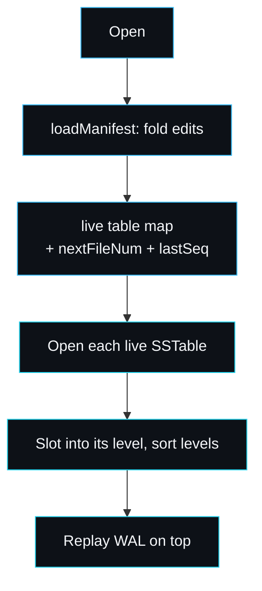

# Manifest and Versioning

The manifest answers one question: which tables are live, and at which level? It
is the source of truth for the on-disk state. A flush adds a table; a compaction
swaps a set of inputs for a set of outputs. Each such change is one durable edit
appended to the manifest, and replaying the edits on open reconstructs the level
layout. The code is `manifest.go`.

## Why an append-only edit log

The obvious alternative is to write the whole live table set to a fresh file and
rename it into place on every change. That is simpler to read back, but every
compaction would rewrite the entire list, and the manifest stops being a natural
atomic commit point. lsmdb uses the version-edit design that LevelDB and RocksDB
use: a log of small, durable deltas. The full reasoning is in
[Design-Decisions](Design-Decisions). The payoff shows up in
[compaction](Compaction): one fsynced edit both adds the outputs and deletes the
inputs, which is the atomic swap.

## The edit

```go
type tableMeta struct {
    FileNum  uint64 `json:"file"`
    Level    int    `json:"level"`
    Smallest []byte `json:"smallest"` // smallest internal key
    Largest  []byte `json:"largest"`  // largest internal key
    Count    int    `json:"count"`
}

type manifestEdit struct {
    Added       []tableMeta `json:"added,omitempty"`
    Deleted     []uint64    `json:"deleted,omitempty"`
    NextFileNum uint64      `json:"next_file,omitempty"`
    LastSeq     uint64      `json:"last_seq,omitempty"`
}
```

Each edit can add tables, delete tables by file number, and advance two running
counters: `NextFileNum` (the next file id to allocate) and `LastSeq` (the highest
sequence committed so far). The `tableMeta` carries the key bounds and entry
count so the engine can reason about overlap and level size without opening the
file.

It is newline-delimited JSON, on purpose. You can read the entire history of a
database's table set with `cat MANIFEST`:

```json
{"added":[{"file":2,"level":0,"smallest":"...","largest":"...","count":812}],"next_file":3,"last_seq":812}
{"added":[{"file":5,"level":1,...}],"deleted":[2,3,4],"next_file":6,"last_seq":2400}
```

The space cost of JSON over a packed binary encoding is irrelevant: the manifest
holds one short line per flush or compaction, not per key. Inspectability won.

## Appending an edit durably

```go
func (m *manifest) append(e manifestEdit) error {
    b, _ := json.Marshal(e)
    b = append(b, '\n')
    m.w.Write(b)
    m.w.Flush()
    return m.f.Sync()
}
```

Every edit is fsynced. This is not optional: the manifest is consulted before the
engine acts on a change. A compaction writes its edit and fsyncs it *before*
deleting any input file (see [Compaction](Compaction)), so a crash in the gap
leaves a consistent database either way.

## Replaying on open

`loadManifest` reads the log line by line and folds the edits into the live set:

```go
for sc.Scan() {
    var e manifestEdit
    if err := json.Unmarshal(line, &e); err != nil {
        break // a torn final edit is ignored, matching WAL semantics
    }
    for _, t := range e.Added {
        tables[t.FileNum] = t
    }
    for _, d := range e.Deleted {
        delete(tables, d)
    }
    if e.NextFileNum > nextFile { nextFile = e.NextFileNum }
    if e.LastSeq > lastSeq { lastSeq = e.LastSeq }
}
```



A missing manifest is the empty-database case: `loadManifest` returns an empty
table map with `nextFile = 1` and `lastSeq = 0`. The `omitempty` JSON tags mean
the buffer scanner must allow long lines (it sets a 16 MiB max token) because a
single edit listing many compaction outputs can be large.

## The torn final edit

A crash mid-append can leave a half-written final line. `loadManifest` stops at
the first line that fails to parse as JSON, exactly the way the
[WAL](Write-Ahead-Log) stops at a torn record. The database falls back to the
last consistent edit. This symmetry is deliberate: the two durable logs in the
engine, the WAL and the manifest, both treat a torn tail as the clean end of a
crashed write.

## Versioning, file numbers and sequences

Two monotonic counters tie the on-disk state together:

- **File numbers** (`nextFileNum`, allocated by `allocFileNum` in `db.go`) name
  every `.sst` and `.log` file uniquely and never repeat. L0 tables are ordered
  by file number so a read scans newer tables first (`fileNumOf` in `record.go`).
- **Sequence numbers** (`lastSeq`) order every write by recency and drive MVCC.
  The manifest persists the high-water mark so a reopened database keeps
  assigning sequences above every committed write. See
  [Internal-Key-and-MVCC](Internal-Key-and-MVCC).

Both counters are written into every edit, so replay restores them even if the
last few WAL records advanced them further (the WAL replay also bumps `lastSeq`,
taking the max).

## Compaction never grows unboundedly here, but the manifest does

This implementation appends to the manifest forever; it does not yet compact the
manifest itself into a fresh snapshot. For a long-lived, write-heavy database the
manifest file grows without bound. Production engines periodically rewrite the
manifest to a compact snapshot and start a new edit log. That is a known gap; see
[Roadmap-and-Limitations](Roadmap-and-Limitations). In practice the manifest
grows one line per flush or compaction, so it stays small for a long time.

## Failure modes

- **Manifest references a missing table.** `Open` returns `open table N: ...`.
  The data directory was modified outside the engine, or a file was lost. The
  manifest is authoritative, so the engine cannot safely continue. See
  [Troubleshooting](Troubleshooting).
- **Orphaned `.sst` files.** A crash mid-compaction can leave output files not
  yet committed, or input files committed as deleted but not yet unlinked. The
  manifest decides liveness, so these are harmless and ignored on open. A sweep
  to remove them is on the roadmap.

## See also

- [Recovery](Recovery) for the full open sequence.
- [Compaction](Compaction) for the atomic swap the manifest enables.
- [Data-Formats](Data-Formats) for the edit's exact JSON shape.

---
SarmaLinux . sarmalinux.com . [lsmdb on GitHub](https://github.com/sarmakska/lsmdb)
