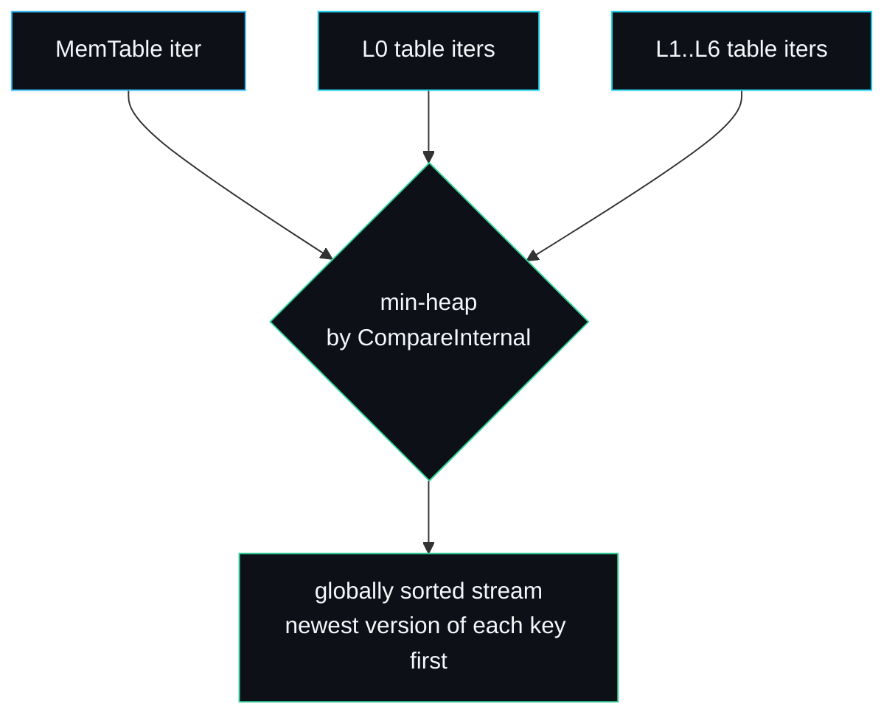

# Merging Iterator

The merging iterator combines several sorted streams into one globally sorted
stream. It is the shared machinery behind two very different operations: an
ordered range scan over the whole database, and a compaction merge of a set of
tables. Both need the same thing, a single cursor walking every source in key
order, so both use the same heap. The code is `iterator.go`, with the public
range cursor in `public_iterator.go`.

## The common interface

Every source the merge pulls from satisfies one small interface:

```go
type internalIterator interface {
    Valid() bool
    Key() encoding.InternalKey
    Value() []byte
    Next()
    SeekToFirst()
    Seek(target encoding.InternalKey)
}
```

Two adapters in `public_iterator.go` make the concrete sources fit it:

```go
type tableIter struct{ it *sstable.Iterator } // wraps an SSTable iterator
type memIter struct{ it *skiplist.Iterator }  // wraps a skip-list iterator
```

So the merge does not care whether a stream comes from memory or disk. It sees
only `internalIterator`s, each yielding internal keys in ascending order.

## The heap

The merge is a min-heap keyed by the [internal-key comparator](Internal-Key-and-MVCC):

```go
func (h iterHeap) Less(i, j int) bool {
    return encoding.CompareInternal(h.items[i].Key(), h.items[j].Key()) < 0
}
```

The smallest current key across all sources sits at the root. Because the
comparator orders user keys ascending and, within a user key, newest version
first, the merged stream is globally sorted in exactly the order both consumers
want: across user keys ascending, and within a user key newest first.



## Advancing

`SeekToFirst` and `Seek` position every source, then keep only the valid ones in
the heap and call `heap.Init`. `Next` advances the source at the root and either
fixes its new position or pops it if it is exhausted:

```go
func (m *mergingIterator) Next() {
    top := m.h.items[0]
    top.Next()
    if top.Valid() {
        heap.Fix(m.h, 0)   // re-sink the advanced source
    } else {
        heap.Pop(m.h)      // this source is done
    }
}
```

Each `Next` is O(log s) where s is the number of sources, since it touches one
source and re-heapifies. For a database with a handful of levels and a few L0
tables, s is small, so a full scan is effectively linear in the number of entries.

## The merge does not collapse versions

A key point: the merging iterator yields *every* version of every key, in order.
It does not decide which version wins or skip tombstones. That policy lives in the
two consumers, because they want different things:

- A **range scan** wants the newest version visible at a snapshot, and wants to
  skip tombstoned keys entirely.
- A **compaction** wants the newest version of each key, wants to keep tombstones
  until the bottom level, and writes the survivors to new tables.

Keeping the merge dumb and the policy in the consumer is what lets one heap serve
both. See [Compaction](Compaction) for the compaction policy.

## The public range iterator

`Iterator` in `public_iterator.go` sits on the merge and collapses versions to
one visible value per user key. The work is in `advanceToVisible`:

```go
func (it *Iterator) advanceToVisible(skipKey []byte) {
    for it.merged.Valid() {
        ik := it.merged.Key()
        uk := ik.UserKey()
        if skipKey != nil && encoding.CompareBytes(uk, skipKey) == 0 {
            it.merged.Next(); continue        // already yielded this user key
        }
        if ik.Sequence() > it.seq {
            it.merged.Next(); continue        // newer than the snapshot
        }
        if ik.Kind() == encoding.KindDelete {
            it.skipUserKey(uk)                // newest visible is a tombstone
            skipKey = append(skipKey[:0], uk...)
            continue
        }
        it.key = append(it.key[:0], uk...)    // first visible live version
        it.value = append(it.value[:0], it.merged.Value()...)
        it.valid = true
        return
    }
    it.valid = false
}
```

It applies four filters as it walks the merged stream:

1. Skip the user key it just yielded (so each key appears once).
2. Skip versions newer than the snapshot sequence (MVCC visibility).
3. If the newest visible version is a tombstone, skip the whole user key.
4. Otherwise emit the first live version and stop.

`skipUserKey` fast-forwards past every remaining version of a key once a decision
is made, so the next `Next` starts cleanly on a new key.

## Building the source set

`newIteratorAt` snapshots the live sources under the read lock and wires them
into the merge:

```go
var iters []internalIterator
iters = append(iters, &memIter{it: db.mem.NewIterator()})
if db.imm != nil {
    iters = append(iters, &memIter{it: db.imm.NewIterator()})
}
for _, t := range db.levels[0] {
    iters = append(iters, &tableIter{it: t.NewIterator()})
}
for lvl := 1; lvl < numLevels; lvl++ {
    for _, t := range db.levels[lvl] {
        iters = append(iters, &tableIter{it: t.NewIterator()})
    }
}
```

The sources are captured under the lock, but the iterator runs without holding
it. That is safe because SSTables are immutable and the MemTable skip list is
append-only: a reader sees a stable view of the keys it has already passed. A
write that arrives mid-scan may or may not be visible depending on where the
cursor is, which is the expected weak-consistency behaviour of a live (non-
snapshot) iterator. Use a [snapshot](Read-Path) iterator for a fixed view.

## Worked example: a scan across levels

`TestOrderedRangeScanAcrossLevels` writes 1,500 keys, overwrites the even ones,
deletes every fifth, and forces the data across the MemTable, L0 and deeper
levels with a tiny `MemTableSize`. The scan must return every live key once, in
order, with the newest value, and never show a deleted key. The merge does the
ordering; `advanceToVisible` does the collapsing. The test counts the survivors
and checks each value, proving the four filters work together across sources.

## Failure modes

- **A live iterator outliving heavy writes.** A non-snapshot iterator has no
  fixed sequence beyond `MaxSequence`, so it sees writes that land ahead of its
  cursor. For a stable view, take a snapshot first.
- **Empty database.** Every source is invalid, the heap is empty, `Valid`
  returns false immediately.
- **Many L0 tables.** Each adds a source to the heap, so a database that has let
  L0 grow (auto-compaction disabled) has a larger s and slightly slower
  per-`Next` cost. Compaction keeps s small.

## See also

- [Read-Path](Read-Path) for snapshots and point lookups.
- [Compaction](Compaction) for the other consumer of the merge.
- [Internal-Key-and-MVCC](Internal-Key-and-MVCC) for the comparator that orders the heap.

---
SarmaLinux . sarmalinux.com . [lsmdb on GitHub](https://github.com/sarmakska/lsmdb)
