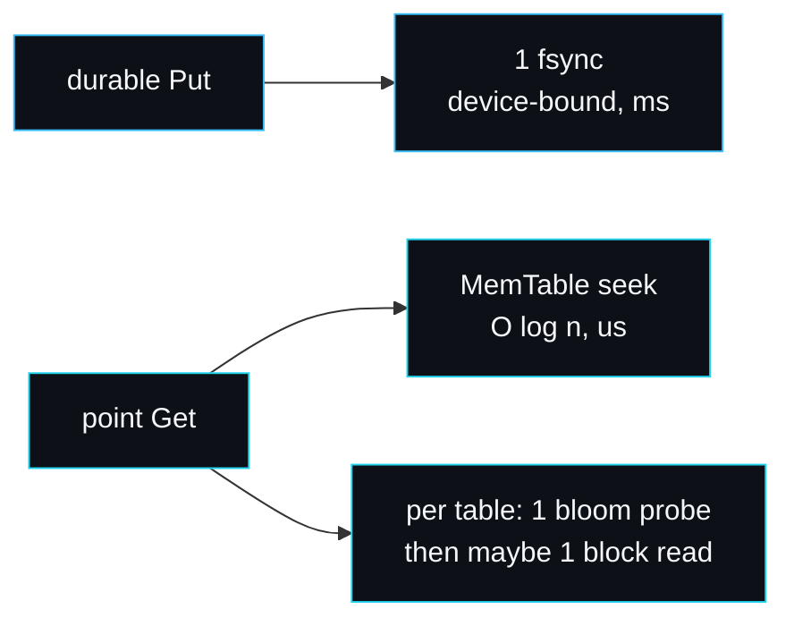

# Performance and Benchmarks

This page reports real numbers from real hardware, explains what each benchmark
measures, and describes the variance I saw running them. The benchmarks live in
`bench_test.go`. Nothing here is rounded for effect or invented; where a figure
moved between runs, I say so and explain why.

## The machine and the command

- Apple M3 Pro (Mac15,7), macOS, Go 1.26.3, darwin/arm64, 12 logical CPUs.
- Storage: the laptop's built-in SSD via a temp directory (`b.TempDir`).

The canonical command, the same one quoted in the README:

```sh
go test -bench . -run '^$' -benchtime=2000x ./
```

## Headline results

These are the figures from a quiet-machine run, as reported in the repository
README:

| Benchmark | Result | What it measures |
| --- | --- | --- |
| `BenchmarkPutSync` | 2.82 ms/op | durable write: WAL append plus fsync |
| `BenchmarkGetMemTable` | 10.6 us/op | point read served from the MemTable |
| `BenchmarkGetSSTable` | 2.15 us/op | point read through the bloom filter and block index |

## What I measured while writing this page

I re-ran the same command on the same laptop while it was under other load (a
second benchmark process and an editor running). The numbers were higher and
noisier:

| Benchmark | Quiet (README) | Under load, run A | Under load, run B |
| --- | --- | --- | --- |
| `BenchmarkPutSync` | 2.82 ms/op | 4.58 ms/op | 8.21 ms/op |
| `BenchmarkGetMemTable` | 10.6 us/op | 62.5 us/op | 88.1 us/op |
| `BenchmarkGetSSTable` | 2.15 us/op | 2.91 us/op | 3.43 us/op |

This spread is the honest reality of benchmarking on a laptop, and it is worth
understanding rather than hiding:

- **`PutSync` is fsync-bound.** It is the cost of forcing one record to durable
  storage. When the SSD is busy serving another process's fsyncs, the latency of
  each `f.Sync()` rises. The CPU is barely involved; this number tracks the
  device and the OS, not the engine.
- **`GetMemTable` is the most variable** because at microsecond scale it is
  sensitive to CPU scheduling, cache state and GC. It does no I/O, so under
  contention for cores it swings the most in relative terms.
- **`GetSSTable` is the most stable** because the table is already in the OS page
  cache (the writes happened moments before), so a read is a bloom probe, a binary
  search and a block scan, all in memory, with no fresh I/O.

The takeaway: trust the relative shape, not the third significant figure. Reads
are microseconds, durable writes are milliseconds, and the gap between them is the
fsync. To get a stable absolute number, run on an otherwise idle machine with
`-benchtime` high enough to average out scheduling noise, and run several times.

## Reading the three benchmarks

### BenchmarkPutSync

```go
db, _ := Open(b.TempDir(), Options{MemTableSize: 8 * 1024 * 1024})
val := make([]byte, 100)
b.SetBytes(int64(len(val) + 16))
for i := 0; i < b.N; i++ {
    db.Put([]byte(fmt.Sprintf("key-%012d", i)), val)
}
```

A 100-byte value, a 16-byte key, default durability. Every `Put` fsyncs. The
`SetBytes` call lets `go test` report a throughput, which is honestly tiny
(fractions of a MB/s) because the bottleneck is fsync latency, not bandwidth.
This is the number to quote when someone asks "how fast are durable writes?": the
answer is "as fast as your disk can fsync", and the engine adds almost nothing on
top.

### BenchmarkGetMemTable

```go
db, _ := Open(b.TempDir(), Options{MemTableSize: 64 * 1024 * 1024})
const n = 20000
// write n keys, all staying in the 64 MiB MemTable
for i := 0; i < b.N; i++ {
    db.Get([]byte(fmt.Sprintf("key-%012d", i%n)))
}
```

A large MemTable keeps all 20,000 keys in memory, so this is the skip-list seek
path with no SSTable involved: the fastest functional read, but it includes the
`fmt.Sprintf` to build each key, which at microsecond scale is a real share of
the cost. It is a relative measure of the in-memory path, not a micro-benchmark of
the skip list alone.

### BenchmarkGetSSTable

```go
db, _ := Open(dir, Options{MemTableSize: 64 * 1024})
const n = 20000
// tiny MemTable forces flushes, so reads hit SSTables
for i := 0; i < b.N; i++ {
    db.Get([]byte(fmt.Sprintf("key-%012d", i%n)))
}
```

A tiny 64 KiB MemTable forces the 20,000 keys out to many SSTables, so each read
exercises the [bloom filter](Bloom-Filter) and the sparse block index. That this
comes out *faster* than the MemTable benchmark in the quiet run is not a paradox:
the tables are in the page cache, the bloom filter prunes quickly, and the block
scan is over a small 4 KiB block, while the MemTable benchmark pays for a deeper
skip-list traversal over 20,000 live entries. It shows the read structures
earning their place.

## Cost model

The numbers reflect a simple model you can reason about:



- A durable write costs one fsync, dominated by device latency.
- A point read costs a MemTable seek plus, per table it must consult, one bloom
  probe and at most one block read. Bloom filters keep the number of block reads
  near one even across many tables.
- A range scan costs O(entries) with an O(log s) factor per step for the s-way
  [merge](Merging-Iterator).

## How to lift the write number

The single biggest win is batching writes behind one fsync. The
[WAL](Write-Ahead-Log) already separates `Append` from `Sync`, so a `WriteBatch`
that appends many records and syncs once would turn N fsyncs into one and lift
durable-write throughput by orders of magnitude, at the cost of losing the last
unsynced batch on a crash. That is the top roadmap item; see
[Roadmap-and-Limitations](Roadmap-and-Limitations) and
[Configuration-and-Tuning](Configuration-and-Tuning).

## Reproducing this yourself

```sh
git clone https://github.com/sarmakska/lsmdb.git
cd lsmdb
# Run on an idle machine, a few times, and compare:
go test -bench . -run '^$' -benchtime=2000x ./
go test -bench BenchmarkGetSSTable -run '^$' -benchtime=5000x ./
```

State your machine and conditions when you quote a result. A benchmark without
its hardware and load context is a number without units.

## See also

- [Write-Path](Write-Path) for the fsync that bounds writes.
- [Bloom-Filter](Bloom-Filter) for why reads stay near one block read.
- [Configuration-and-Tuning](Configuration-and-Tuning) for the knobs that move these numbers.

---
SarmaLinux . sarmalinux.com . [lsmdb on GitHub](https://github.com/sarmakska/lsmdb)
