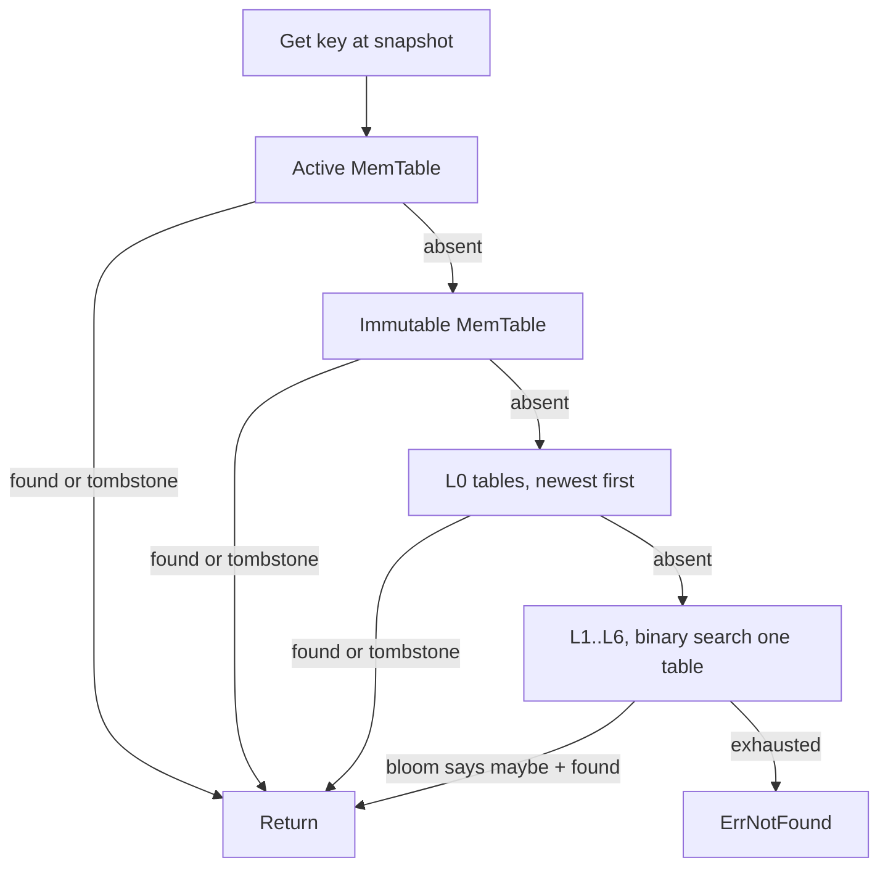

# Read Path

This page follows a read from the public API to a value, covering point lookups,
MVCC, snapshots and ordered range scans. The relevant code is `db.go`
(`Get`, `getAt`, `findTable`), `public_iterator.go` (the range iterator and
`Snapshot`), and `iterator.go` (the merging iterator).

## Point lookups



`Get` resolves a key against the latest committed sequence. Internally it calls
`getAt(key, snap)`, which consults sources from newest to oldest and stops at the
first source that holds any version of the key:

```go
if v, found, ok := db.mem.Get(key, snap); ok {
    return finish(v, found)
}
if db.imm != nil {
    if v, found, ok := db.imm.Get(key, snap); ok {
        return finish(v, found)
    }
}
for i := len(db.levels[0]) - 1; i >= 0; i-- {
    if v, found, ok := db.levels[0][i].Get(key, snap); ok {
        return finish(v, found)
    }
}
for lvl := 1; lvl < numLevels; lvl++ {
    if r := db.findTable(db.levels[lvl], key); r != nil {
        if v, found, ok := r.Get(key, snap); ok {
            return finish(v, found)
        }
    }
}
return nil, ErrNotFound
```

The `(value, found, ok)` triple is the key to correct shadowing. `ok` reports
that a source holds some version of the key at or below the snapshot; `found`
reports whether that newest version is a live value rather than a tombstone. The
first source that returns `ok == true` decides the result, because any version
it holds is newer than versions in deeper sources. If that version is a
tombstone (`found == false`), the lookup returns `ErrNotFound` and never reads a
deeper table. This is how a delete correctly hides an older value living in a
lower level.

## Why the order matters

Sources are searched newest first:

- The active MemTable holds the most recent writes.
- The immutable MemTable, if a flush is in progress, holds the next most recent.
- L0 tables overlap, so they are scanned from the most recently flushed
  (appended last) backwards.
- Levels 1 and below are disjoint, so `findTable` binary searches for the single
  table whose range could contain the key and reads only that one.

## Bloom filters cut the work

Each SSTable carries a bloom filter over its user keys
(`internal/bloom/bloom.go`). `Reader.Get` consults it first:

```go
if !r.filter.MayContain(userKey) {
    return nil, false, false
}
```

A bloom filter never reports a false negative, so a "no" is definitive and the
table is skipped without reading a data block. A "yes" might be a false positive,
which costs one block read. The filter is sized for a one percent false positive
rate by default, and the test suite verifies the observed rate stays within
bounds. This is what keeps read amplification low when a key is absent from most
tables.

## Inside a table

Within a table, `Get` seeks the sparse block index for the data block that could
contain the key, reads that one block, and scans it. The seek key is built at the
maximum sequence for the user key, so the seek lands on the newest version at or
below the snapshot. See [SSTable-Format](SSTable-Format) for the block layout.

## MVCC and snapshots

A `Snapshot` captures the current committed sequence number:

```go
func (db *DB) Snapshot() *Snapshot {
    db.mu.RLock()
    defer db.mu.RUnlock()
    return &Snapshot{db: db, seq: db.lastSeq}
}
```

A read through the snapshot calls `getAt(key, s.seq)`. Every lookup skips
versions whose sequence is greater than the snapshot's, so a snapshot never
observes writes that happened after it was taken. Two snapshots taken at
different times see two different consistent views of the database, even as
writes continue. The `TestMVCCSnapshotIsolation` test demonstrates this: a
snapshot taken before an overwrite and a delete still reads the old value and
still sees the deleted key.

Snapshots do not pin storage in this implementation; the engine retains old
versions until compaction reclaims them. For a long-lived snapshot the
application should keep the write volume bounded so the versions it needs are not
yet compacted away.

## Ordered range scans

`NewIterator` returns an iterator that walks user keys in ascending order. It is
built on a heap-based merging iterator (`iterator.go`) over every live source:
the MemTables and every SSTable. The merging iterator yields internal keys in
global order, which means across user keys ascending and within a user key newest
first.

The public iterator (`public_iterator.go`) sits on top and collapses versions to
a single visible value per user key:

```go
func (it *Iterator) advanceToVisible(skipKey []byte) {
    for it.merged.Valid() {
        ik := it.merged.Key()
        uk := ik.UserKey()
        if skipKey != nil && encoding.CompareBytes(uk, skipKey) == 0 {
            it.merged.Next(); continue
        }
        if ik.Sequence() > it.seq {           // not visible at snapshot
            it.merged.Next(); continue
        }
        if ik.Kind() == encoding.KindDelete {  // newest visible is a tombstone
            it.skipUserKey(uk); ...; continue
        }
        // first visible live version of this user key
        it.key = append(it.key[:0], uk...)
        it.value = append(it.value[:0], it.merged.Value()...)
        it.valid = true
        return
    }
    it.valid = false
}
```

The iterator skips versions newer than the snapshot, skips older duplicate
versions of a key it has already yielded, and skips keys whose newest visible
version is a tombstone. The result is a clean, sorted stream of live key-value
pairs. `TestOrderedRangeScanAcrossLevels` checks this across data spread over the
MemTable, L0 and deeper levels, with overwrites and deletes mixed in.

## See also

- [Write-Path](Write-Path) for how versions get written.
- [Internal-Key-and-MVCC](Internal-Key-and-MVCC) for the versioned key and snapshots.
- [Merging-Iterator](Merging-Iterator) for the heap behind range scans.
- [Bloom-Filter](Bloom-Filter) for the membership filter that cuts the work.
- [SSTable-Format](SSTable-Format) for the bloom filter and block index.
- [Compaction](Compaction) for how old versions are eventually removed.

---
SarmaLinux . sarmalinux.com . [lsmdb on GitHub](https://github.com/sarmakska/lsmdb)
