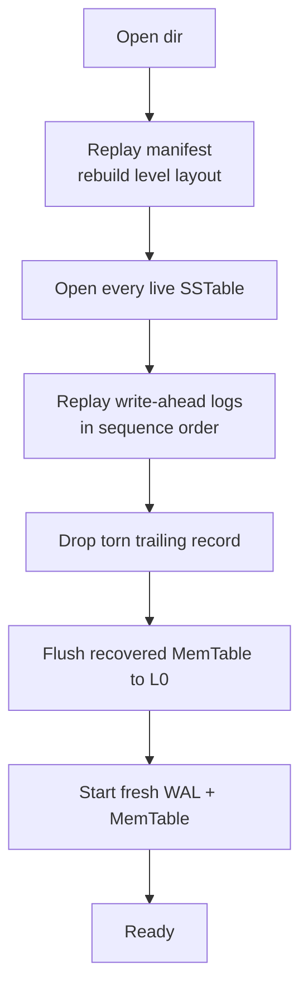

# Recovery

Recovery is what makes lsmdb durable. The contract is simple: a Put or Delete
that returned nil is recovered after a crash, and a write that was only partially
persisted is discarded cleanly. This page explains how open, the write-ahead log
and the manifest combine to deliver that contract. The code is `db.go`
(`Open`, `recoverLog`), `internal/wal/wal.go` and `manifest.go`.

## What happens on open



`Open` runs these steps in order:

1. **Replay the manifest** to learn which tables are live and at which level.
2. **Open each live table** and slot it into its level, then sort the levels.
3. **Replay the write-ahead logs** back into the MemTable to recover
   acknowledged writes that had not yet been flushed.
4. **Flush the recovered MemTable** to a new L0 table so the recovered state is
   durable in an SSTable before normal operation resumes.
5. **Start a fresh log and MemTable** for new writes.

## The manifest

The manifest (`manifest.go`) is an append-only log of edits. Each edit is one
durable change to the table set, written as newline-delimited JSON and fsynced:

```go
type manifestEdit struct {
    Added       []tableMeta
    Deleted     []uint64
    NextFileNum uint64
    LastSeq     uint64
}
```

Replaying the edits in order reconstructs the live table set: an added table is
inserted, a deleted file number is removed, and the running `NextFileNum` and
`LastSeq` are advanced. This is the same version-edit idea LevelDB and RocksDB
use, kept deliberately small and inspectable here.

A torn final edit from a crash mid-append is handled the same way the WAL handles
a torn record: `loadManifest` stops at the first line that fails to parse, so a
half-written edit is ignored and the database falls back to the last consistent
state.

## The write-ahead log

Each record in the log is framed with a CRC and a length:

```
+----------+--------+-----------+
| crc32 4B | len 4B | payload   |
+----------+--------+-----------+
```

`recoverLog` opens every pre-existing log file in sequence-number order and
replays each record into the MemTable:

```go
for {
    rec, err := r.Next()
    if err != nil {
        break // io.EOF, clean end or torn tail
    }
    seq, kind, key, value, ok := decodeRecord(rec)
    if !ok {
        continue
    }
    db.mem.Add(seq, kind, key, value)
    if seq > db.lastSeq {
        db.lastSeq = seq
    }
}
```

## How a torn write is detected

A crash can leave a partially written final record: the process died after
writing some bytes but before the whole record reached the disk. The WAL reader
treats this as the natural end of a crashed write rather than an error:

```go
func (r *Reader) Next() ([]byte, error) {
    // short read of the header or payload -> torn tail -> io.EOF
    // CRC mismatch on the payload      -> torn tail -> io.EOF
}
```

Two cases stop replay cleanly:

- **A short read.** If the header or payload is shorter than its declared length,
  the record was never fully written, so replay stops.
- **A CRC mismatch.** If the payload's CRC does not match the stored CRC, the
  record is corrupt or incomplete, so replay stops.

Either way the earlier, fully durable records are recovered and the torn tail is
dropped. `TestRecoveryDropsTornTail` appends deliberate garbage to a log and
checks that the good records survive and the garbage is ignored.
`internal/wal/wal_test.go` covers truncation and a flipped payload byte directly.

## Why the contract holds

The durability barrier in the write path fsyncs the log before acknowledging a
write. So at the moment a Put returns nil, its record is on disk with a valid CRC.
A later crash cannot lose it: recovery will find and replay it. A write that was
in flight when the crash happened either has a complete, valid record (and is
recovered) or a torn one (and is dropped). There is no in-between.

The `TestDurabilityAndRecovery` test writes two thousand keys, abandons the
handle without calling Close to simulate a crash, reopens the database, and
verifies every committed key is present. Because the test never closes the
database, the data lives only in the synced log at crash time, exactly the case
recovery must handle.

## Ordering between the log and the manifest

The old log for a MemTable is deleted only after that MemTable has been flushed
to an SSTable and the flush has been recorded with a durable manifest edit.
Until the manifest edit is durable, the log is the source of truth and is
replayed on open. This ordering means there is never a window where committed
data exists in neither the log nor a recorded table.

## A walkthrough you can run

To see the contract end to end, save this as `crash_test.go` in the repo root and
run `go test -run TestCrashWalkthrough -v ./`. It writes a committed key, drops
the handle without Close to stand in for a crash, reopens, and checks that the
committed write came back and that nothing it never wrote did.

```go
package lsmdb

import "testing"

func TestCrashWalkthrough(t *testing.T) {
	dir := t.TempDir()

	// Session one: write, then "crash" by abandoning the handle. The MemTable
	// is lost; the synced WAL is not.
	db, _ := Open(dir, Options{})
	if err := db.Put([]byte("committed"), []byte("survives")); err != nil {
		t.Fatal(err)
	}
	// No db.Close(). The process is gone.

	// Session two: reopen. recoverLog replays the synced WAL.
	db2, _ := Open(dir, Options{})
	defer db2.Close()

	got, err := db2.Get([]byte("committed"))
	if err != nil || string(got) != "survives" {
		t.Fatalf("committed write did not survive: %q %v", got, err)
	}
	if _, err := db2.Get([]byte("never-written")); err != ErrNotFound {
		t.Fatalf("a key that was never written came back: %v", err)
	}
}
```

The committed key survives because `Put` fsynced its WAL record before returning.
On reopen, `recoverLog` replays the log into the MemTable and flushes it to L0. A
write that was only half-written at crash time fails its CRC and is dropped, so
an uncommitted record never resurrects. This is the same property
`TestDurabilityAndRecovery` checks at two thousand keys, and the other half is
what `TestRecoveryDropsTornTail` checks by appending garbage to a log.

## See also

- [Write-Path](Write-Path) for the durability barrier that makes recovery
  possible.
- [Compaction](Compaction) for the atomic table swap through the manifest.
- [Troubleshooting](Troubleshooting) for recovery-related symptoms.

---
SarmaLinux . sarmalinux.com . [lsmdb on GitHub](https://github.com/sarmakska/lsmdb)
