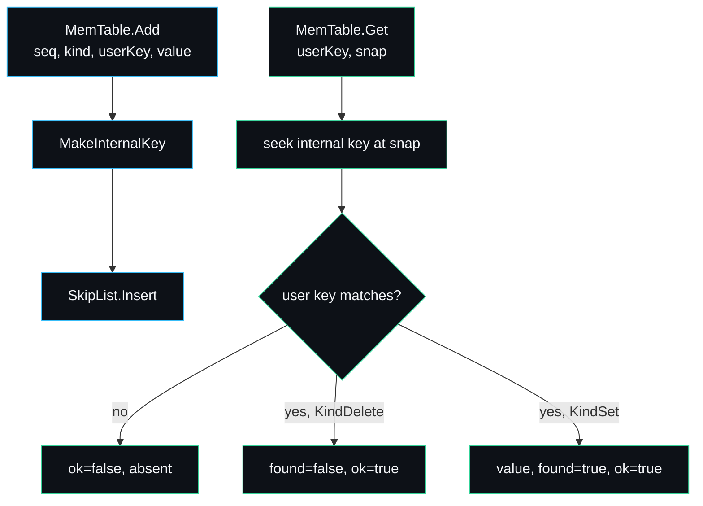

# Skip List and MemTable

The MemTable is the in-memory write buffer. Every write that survives the
[durability barrier](Write-Path) lands here before it ever reaches a file, and
every read consults it first. It is the only mutable data structure in the
engine; once data leaves the MemTable as an [SSTable](SSTable-Format) it is
immutable forever. The code is `internal/skiplist/skiplist.go` and
`internal/memtable/memtable.go`.

## Two layers

The MemTable is thin. `internal/memtable/memtable.go` wraps a skip list and adds
exactly two things the skip list does not know about: how to build a versioned
[internal key](Internal-Key-and-MVCC) from a user key, and how to answer an
MVCC-aware point lookup. Everything else (ordering, insert, iteration) is the
skip list's job.



## Why a skip list

A write buffer has a specific access pattern: one goroutine inserts under the
engine's write lock, and many goroutines scan it during reads under the read
lock. It needs ordered iteration (the flush feeds a sorted stream into the
SSTable writer) and fast insert and search. The candidates and why the skip list
won are spelled out in [Design-Decisions](Design-Decisions); the short version
is that a sorted slice inserts in O(n), a B-tree makes lock-light concurrent
reads awkward, and a skip list gives expected O(log n) insert and search with a
structure a reader can walk forward as a single writer splices into it.

## The skip list internals

`SkipList` (`internal/skiplist/skiplist.go`) is a classic Pugh skip list keyed
by internal keys. Constants set its shape:

```go
const (
    maxHeight = 12
    branching = 4 // 1-in-4 chance of promoting a node a level up
)
```

A node's height is drawn from a geometric distribution in `randomHeight`: start
at one, and with probability 1/4 add another level, up to `maxHeight`. With
branching 4 and height 12 the structure indexes up to roughly four million
entries before the top level stops helping, which comfortably covers a MemTable
bounded at a few mebibytes.

`findGreaterOrEqual` is the heart of the structure. It walks from the highest
active level down, advancing along a level while the next node is still less than
the target, then dropping a level. Passing a `prev` slice records the
predecessor at each level so `Insert` can splice in O(height):

```go
func (s *SkipList) findGreaterOrEqual(key encoding.InternalKey, prev []*node) *node {
    x := s.head
    level := s.height - 1
    for {
        nxt := x.next[level]
        if nxt != nil && encoding.CompareInternal(nxt.key, key) < 0 {
            x = nxt
            continue
        }
        if prev != nil {
            prev[level] = x
        }
        if level == 0 {
            return nxt
        }
        level--
    }
}
```

### Insert never overwrites

`Insert` always splices a new node. That looks wrong for a key-value store until
you remember the keys are internal keys, not user keys: every write carries a
fresh, strictly increasing [sequence number](Internal-Key-and-MVCC), so two
writes to the same user key produce two distinct internal keys that never
collide. An overwrite is just a newer version that sorts ahead of the old one.
This is what makes MVCC fall out for free.

```go
// The caller guarantees keys are unique (a fresh sequence per write), so
// Insert always splices a new node rather than overwriting.
```

### Values live in a side map

The value is not stored in the node. The list keeps a `map[*node][]byte`:

```go
type SkipList struct {
    mu     sync.RWMutex
    head   *node
    height int
    rng    *rand.Rand
    size   int64
    values map[*node][]byte
}
```

This keeps the node struct small (just the key and the `next` pointer slice) and
keeps the comparator working on keys alone. The map is read under the same
`RWMutex` that guards the structure.

### Deterministic randomness

The height RNG is seeded with a fixed constant:

```go
rng: rand.New(rand.NewSource(0xC0FFEE)),
```

A fixed seed makes flush output and therefore test behaviour deterministic. It
does not weaken the structure: the geometric height distribution is what matters
for balance, and the seed only fixes which nodes get which heights. There is no
adversarial input concern here because keys arrive from a trusted in-process
caller, not over a network.

## Size accounting and the flush trigger

The skip list tracks an approximate byte footprint so the engine knows when to
flush:

```go
s.size += int64(len(key) + len(value) + 8)
```

`MemTable.ApproximateSize` returns this, and `db.write` compares it against
`Options.MemTableSize` (4 MiB by default) to decide when to call
`rotateMemtableLocked`. The figure is approximate by design: it counts key bytes,
value bytes and an eight-byte allowance per entry, not the skip-list pointer
overhead or the Go map overhead, so real resident memory runs somewhat higher.
For sizing the flush this is the right number, because it tracks the data that
must be written, not the structure that holds it. See
[Configuration-and-Tuning](Configuration-and-Tuning) for picking the threshold.

## The MVCC point lookup

`MemTable.Get` is where versioning shows up at read time:

```go
func (m *MemTable) Get(userKey []byte, snap uint64) (value []byte, found, ok bool) {
    seekKey := encoding.MakeInternalKey(userKey, snap, encoding.KindSet)
    it := m.list.NewIterator()
    it.Seek(seekKey)
    if !it.Valid() {
        return nil, false, false
    }
    ik := it.Key()
    if string(ik.UserKey()) != string(userKey) {
        return nil, false, false
    }
    if ik.Kind() == encoding.KindDelete {
        return nil, false, true
    }
    return it.Value(), true, true
}
```

The seek key carries the snapshot sequence. Because higher sequences sort first
within a user key, the seek lands on the newest version at or below `snap`,
skipping anything newer. The `(value, found, ok)` triple is the same contract the
SSTable reader uses, which lets the read path treat every source uniformly: `ok`
means a version was found, `found` means that version is live rather than a
tombstone. See [Read-Path](Read-Path) for how the engine chains sources.

## The immutable MemTable

`DB` holds two MemTable fields: `mem` (the active write buffer) and `imm` (a
frozen one being flushed). In the current engine the flush is inline under the
write lock, so `imm` is set only transiently; the read path checks it for
completeness so that a future background flush can populate it without changing
read semantics. See [Architecture](Architecture) on the concurrency model and
[Roadmap-and-Limitations](Roadmap-and-Limitations) on moving the flush off the
write lock.

## Concurrency

The list takes a `sync.RWMutex`. `Insert` takes the write lock; `Seek`,
`SeekToFirst`, `Next` and `Value` take the read lock. The engine's own
`sync.RWMutex` already serialises writes, so in practice the list sees one writer
at a time, but the list does its own locking so it is correct in isolation and so
the test suite can exercise it directly. The race detector run in CI
(`go test -race ./...`) covers this.

## Failure modes

- **Unbounded MemTable.** Setting `MemTableSize` very large (the
  `TestDurabilityAndRecovery` test uses 1 GiB to force everything into the WAL)
  means the MemTable never flushes and resident memory grows with the data. That
  is intentional in the test; in production keep the threshold to a few MiB.
- **A nil value versus a tombstone.** `Put(key, nil)` stores a live, empty value
  (`KindSet`, zero-length). Only `Delete` writes a `KindDelete` tombstone. A
  reader distinguishes them: the empty value reads back as a present empty slice,
  the tombstone reads back as `ErrNotFound`.

## See also

- [Internal-Key-and-MVCC](Internal-Key-and-MVCC) for the key the list is sorted by.
- [Write-Path](Write-Path) for how Add is called and when a flush fires.
- [Read-Path](Read-Path) for how Get fits the multi-source lookup.
- [Merging-Iterator](Merging-Iterator) for how the list iterator joins the merge.

---
SarmaLinux . sarmalinux.com . [lsmdb on GitHub](https://github.com/sarmakska/lsmdb)
