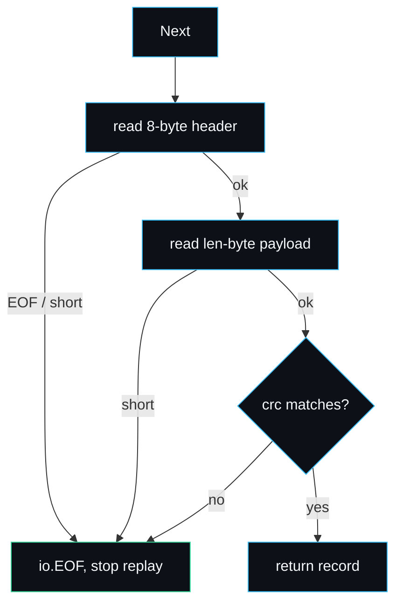

# Write-Ahead Log

The write-ahead log is the single reason lsmdb can promise durability. Before a
write touches memory or returns to the caller, its record is appended to the log
and fsynced. If the process dies a microsecond later, [recovery](Recovery)
replays that record. The code is `internal/wal/wal.go`, with the record codec in
`record.go`.

## The contract

A `Put` or `Delete` that returns `nil` has been fsynced to the log. There is no
weaker mode in the engine: every acknowledged write is durable. The cost is one
fsync per write, which is honest and device-bound; see
[Performance-and-Benchmarks](Performance-and-Benchmarks) for the real numbers
and [Configuration-and-Tuning](Configuration-and-Tuning) for why a future
batched path would relax it.

## Record framing

Each record is a CRC, a length, then the payload:

```
+----------+--------+-----------+
| crc32 4B | len 4B | payload   |
+----------+--------+-----------+
```

The CRC is Castagnoli (CRC-32C), the same polynomial RocksDB and many storage
systems use, chosen because modern CPUs have a hardware instruction for it:

```go
var castagnoli = crc32.MakeTable(crc32.Castagnoli)
```

The CRC covers the payload only, not the header. That is enough: a torn header
fails the short-read check before the CRC is ever consulted, and a torn or
flipped payload fails the CRC. The length is stored little-endian as a `uint32`,
so a single record payload is bounded at 4 GiB, far above any real key-value
pair.

## Append and Sync are separate

The writer splits writing a record from making it durable:

```go
func (w *Writer) Append(payload []byte) error {
    // write header + payload into the bufio.Writer, no fsync
}

func (w *Writer) Sync() error {
    // flush the buffer, then f.Sync() -- the durability barrier
}
```

`Append` writes into a `bufio.Writer`; `Sync` flushes that buffer and calls
`f.Sync()`. The engine calls `Append` then `Sync` on every write today, so the
two are effectively one operation. They are kept separate on purpose: a
`WriteBatch` that appends many records and syncs once is the planned throughput
win, and the WAL plumbing for it already exists (see
[Roadmap-and-Limitations](Roadmap-and-Limitations)). `Close` also flushes and
syncs, so a clean shutdown loses nothing in the buffer.

## The payload codec

The WAL layer is format-agnostic: it frames arbitrary byte payloads. The engine
fills the payload with the mutation, encoded in `record.go`:

```
seq (8B, little-endian) | kind (1B) | varint(keyLen) | key | varint(valueLen) | value
```

`encodeRecord` builds it and `decodeRecord` reverses it, returning `ok == false`
for a malformed record. The split is clean: the WAL owns durability framing (CRC
and length), the engine owns the mutation fields. The full byte layout is in
[Data-Formats](Data-Formats).

## Reading back, and the torn tail

`Reader.Next` returns one record at a time and treats a crashed write as the
natural end of the log rather than an error:

```go
func (r *Reader) Next() ([]byte, error) {
    var header [8]byte
    if _, err := io.ReadFull(r.r, header[:]); err != nil {
        if err == io.ErrUnexpectedEOF || err == io.EOF {
            return nil, io.EOF        // clean end, or a torn header
        }
        return nil, err
    }
    want := binary.LittleEndian.Uint32(header[0:4])
    length := binary.LittleEndian.Uint32(header[4:8])
    payload := make([]byte, length)
    if _, err := io.ReadFull(r.r, payload); err != nil {
        return nil, io.EOF            // short payload -> torn tail
    }
    if crc32.Checksum(payload, castagnoli) != want {
        return nil, io.EOF            // bad CRC -> torn tail
    }
    return payload, nil
}
```

Three things stop replay cleanly, and all three return `io.EOF` so the caller's
`for { rec, err := r.Next(); if err != nil { break } }` loop ends naturally:

1. **Clean end of file.** The header read hits EOF on a record boundary.
2. **Short read.** The header or payload is shorter than declared, meaning the
   process died mid-write. The record was never durable.
3. **CRC mismatch.** The bytes on disk do not hash to the stored CRC, meaning the
   payload is corrupt or incomplete.



This is the central durability guarantee made concrete: a half-written record can
never be replayed as if it were committed.

## What the tests prove

`internal/wal/wal_test.go` covers the framing directly:

- `TestRoundTrip` writes three records and reads them back intact in order.
- `TestTornTailIgnored` writes three records, truncates inside the last payload,
  and checks only the two fully durable records come back.
- `TestCorruptCrcStops` flips the final payload byte and checks replay stops at
  the corrupt record rather than returning garbage.

At the engine level, `TestDurabilityAndRecovery` writes two thousand keys,
abandons the handle without `Close` to simulate a crash, reopens, and verifies
every committed key returns. Because the test never closes the database, the data
exists only in the synced WAL at crash time, exactly the case the log must
handle. See [Testing-Strategy](Testing-Strategy).

## Lifecycle: one log per MemTable

Each active MemTable has exactly one WAL. When the MemTable rotates
(`rotateMemtableLocked` in `db.go`), the engine:

1. Flushes the frozen MemTable to an L0 SSTable.
2. Creates a fresh WAL for the new MemTable.
3. Closes and removes the old WAL.

The old log can be removed only after the data it covers is durable in an SSTable
and recorded in the [manifest](Manifest-and-Versioning). Until that manifest edit
is fsynced, the log stays the source of truth and is replayed on open, so there
is never a gap where committed data lives in neither the log nor a recorded table.
[Recovery](Recovery) walks the ordering in detail.

## Failure modes

- **A full disk during Sync.** `f.Sync()` returns an error, which propagates out
  of `Put` as a non-nil error. The write is not acknowledged, which is correct:
  the caller must treat a failed `Put` as not durable.
- **Files modified by another process.** Out of scope per `SECURITY.md`. The CRC
  protects against incomplete writes from a crash, not against a hostile process
  rewriting the log while the database is open.
- **A foreign file named `NNNNNN.log`.** Recovery tries to parse it; records that
  fail the CRC stop replay. A genuinely foreign file would likely fail on the
  first record and contribute nothing, which is safe but not validated as
  foreign-versus-torn.

## See also

- [Write-Path](Write-Path) for where Append and Sync sit in a Put.
- [Recovery](Recovery) for replaying every log on open.
- [Data-Formats](Data-Formats) for the exact record bytes.
- [Manifest-and-Versioning](Manifest-and-Versioning) for the log-to-manifest handoff.

---
SarmaLinux . sarmalinux.com . [lsmdb on GitHub](https://github.com/sarmakska/lsmdb)
