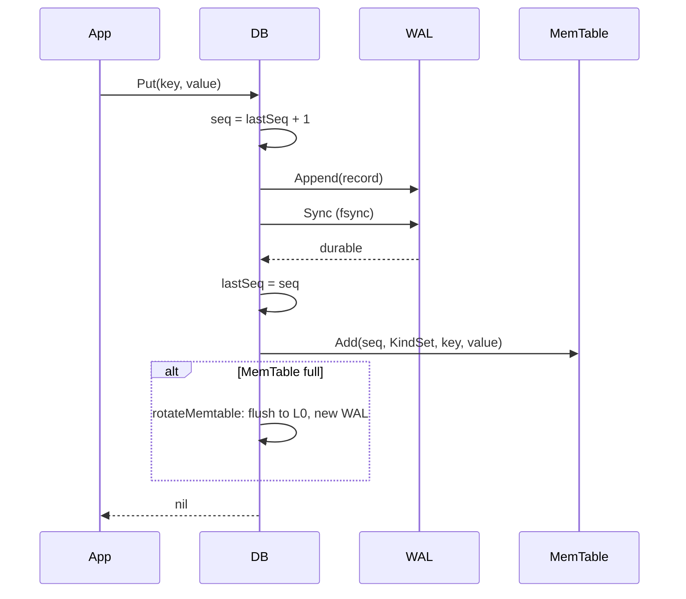

# Write Path

This page follows a write from the public API call to durable storage. The
relevant code is `db.go` (`Put`, `Delete`, `write`, `rotateMemtableLocked`,
`flushMemtableLocked`), `record.go` (the WAL record codec) and
`internal/wal/wal.go`.

## The life of a Put



`Put` and `Delete` are thin wrappers over one internal `write` method.
A delete is just a write with `KindDelete` and a nil value, which records a
tombstone rather than removing anything in place.

```go
func (db *DB) Put(key, value []byte) error {
    return db.write(encoding.KindSet, key, value)
}

func (db *DB) Delete(key []byte) error {
    return db.write(encoding.KindDelete, key, nil)
}
```

## Step 1: assign a sequence number

Under the write lock the engine assigns the next sequence number,
`seq = lastSeq + 1`. Sequence numbers are monotonic and unique, so they totally
order all writes by recency. This ordering is what later lets a snapshot read
ignore writes that happened after it, and lets compaction keep only the newest
version of a key.

## Step 2: durability barrier

The mutation is encoded and appended to the write-ahead log, then the log is
fsynced. Only after the fsync returns does the engine update in-memory state or
acknowledge the caller:

```go
rec := encodeRecord(seq, kind, key, value)
if err := db.log.Append(rec); err != nil {
    return err
}
if err := db.log.Sync(); err != nil {
    return err
}
```

The WAL record framing (`internal/wal/wal.go`) is a CRC, a length and the
payload:

```
+----------+--------+-----------+
| crc32 4B | len 4B | payload   |
+----------+--------+-----------+
```

The CRC and length let recovery detect a record that was only partially written
when the process died, and stop cleanly at that point. See [Recovery](Recovery).

The record payload itself (`record.go`) is `seq (8B), kind (1B), varint(keyLen),
key, varint(valueLen), value`, which is self-describing for the fields the
engine owns.

## Step 3: apply to the MemTable

After the write is durable the engine inserts it into the active MemTable:

```go
db.lastSeq = seq
db.mem.Add(seq, kind, key, value)
```

The MemTable builds the internal key and inserts it into the skip list. Because
each write has a unique, increasing sequence, inserts never collide; an
overwrite of a key simply inserts a new version that sorts ahead of the old one.

## Step 4: rotate when full

When the MemTable's approximate size reaches `Options.MemTableSize`, the engine
rotates it. `rotateMemtableLocked` flushes the full MemTable to a new L0 SSTable,
starts a fresh MemTable and a fresh write-ahead log, removes the old log, and
considers a compaction:

```go
func (db *DB) rotateMemtableLocked() error {
    frozen := db.mem
    oldLogNum := db.logNum
    if err := db.flushMemtableLocked(frozen); err != nil {
        return err
    }
    // new WAL and MemTable, drop the old WAL, maybe compact
    ...
}
```

The old write-ahead log can be deleted only after the MemTable it covers is
durably flushed to an SSTable and recorded in the manifest. The order in
`flushMemtableLocked` is: write the table, fsync it, append the manifest edit
(fsynced), then add it to the in-memory level set. Until the manifest edit is
durable, a crash would fall back to replaying the log, so no data can be lost in
the gap.

## Flushing a MemTable

`flushMemtableLocked` iterates the MemTable in internal-key order and streams the
entries into an SSTable writer:

```go
it := mt.NewIterator()
for it.SeekToFirst(); it.Valid(); it.Next() {
    if err := w.Add(it.Key(), it.Value()); err != nil {
        w.Abort()
        return err
    }
}
```

The SSTable writer requires globally sorted input, which the skip list iterator
provides for free. The new table goes to level 0. Because each MemTable becomes
one L0 table and MemTables cover overlapping key ranges over time, L0 tables can
overlap, which is why the read path scans all of L0 rather than binary searching
it.

## Write amplification and the fsync cost

Every Put fsyncs the log. This is the honest cost of a crash-safe write and is
dominated by the latency of the underlying device's fsync. The
`BenchmarkPutSync` benchmark measures exactly this. If your workload can tolerate
losing the last few milliseconds of writes on a crash, a production deployment
would batch several writes behind one fsync; the WAL append and sync are already
separate calls to make that change small.

## See also

- [Read-Path](Read-Path) for how these writes are read back.
- [SSTable-Format](SSTable-Format) for what a flushed table looks like.
- [Recovery](Recovery) for what happens to the log on restart.

---
SarmaLinux . sarmalinux.com . [lsmdb on GitHub](https://github.com/sarmakska/lsmdb)
