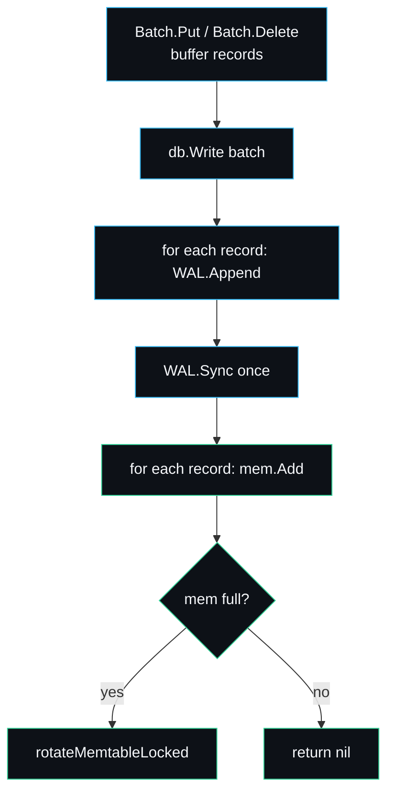

# Writing an Extension

lsmdb is small on purpose, so adding to it is mostly a matter of finding the one
seam a feature belongs to and respecting the invariants around it. This page is a
contributor's guide: how the code is laid out, where the seams are, and a couple
of worked walkthroughs for the features on the [roadmap](Roadmap-and-Limitations).
The non-negotiable rule is that no change may weaken the durability or recovery
contract; the [tests](Testing-Strategy) are how you prove it did not.

## Ground rules

1. **Standard library only.** `go.mod` has zero `require` lines and that is a
   feature ([Design-Decisions](Design-Decisions)). A change that pulls in a
   dependency needs a very good reason.
2. **The durability contract is sacred.** A `Put` that returns nil must be
   fsynced. Any change near the [WAL](Write-Ahead-Log) or
   [manifest](Manifest-and-Versioning) must keep `TestDurabilityAndRecovery` and
   the torn-tail tests green.
3. **Keep the public surface small.** Seven methods. Adding one is a real
   decision, not a default. See [API-Reference](API-Reference).
4. **CI must pass:** `gofmt -l .` clean, `go vet ./...`, `go build ./...`,
   `go test -race ./...`. See `.github/workflows/ci.yml`.

## The seams

| You want to change... | Touch | Keep green |
| --- | --- | --- |
| The on-disk record bytes | `record.go`, `internal/wal` | recovery tests, bump format if needed |
| The table format | `internal/sstable/{format,writer,reader}.go` | `sstable_test.go`, bump `magic` |
| The membership filter | `internal/bloom` | `bloom_test.go` (no false negatives) |
| The in-memory buffer | `internal/skiplist`, `internal/memtable` | round-trip + race tests |
| The compaction policy | `compaction.go` (`pickCompaction`, `runCompaction`) | `TestCompactionCorrectnessAndReclamation` |
| The read resolution | `db.go` (`getAt`), `public_iterator.go` | MVCC + range-scan tests |
| A new option | `Options` + `withDefaults` in `db.go` | zero value must keep working |

## The version-edit seam

The cleanest place to extend behaviour is the [manifest](Manifest-and-Versioning).
`manifestEdit` is the atomic unit of on-disk change. Anything that needs to record
durable state about tables (a new property, a retained sequence, a compaction
hint) can add an `omitempty` field to `manifestEdit` and have `loadManifest` fold
it in. Old manifests stay readable because missing fields decode to zero. This is
how snapshot pinning and several other roadmap items would land without a format
break.

## Walkthrough: a WriteBatch (top roadmap item)

Goal: append many records and fsync once, trading a little durability for a lot of
throughput. The [WAL](Write-Ahead-Log) already separates `Append` from `Sync`, so
the plumbing exists.

Sketch:

1. A `Batch` type accumulating `(kind, key, value)` tuples.
2. A `db.Write(b *Batch)` that takes the write lock, assigns one sequence per
   record (advancing `lastSeq`), calls `db.log.Append` per record and `db.log.Sync`
   **once**, then `db.mem.Add` per record, then checks the flush threshold.
3. The existing single-`Put` path becomes a one-record batch internally.

The contract change to document: a `Write` that returns nil is durable; records in
an uncommitted batch are not. Recovery already replays whatever was synced, so a
crash mid-batch (before `Sync`) drops the whole batch cleanly, which is the
desired semantics. Add a test that writes a batch, "crashes", reopens, and checks
all-or-nothing.

## Walkthrough: background compaction

Goal: move flush and compaction off the write lock so writers do not stall. This
is the highest-risk change because it introduces concurrent mutation of the level
layout, which is exactly what the current inline design avoids
([Design-Decisions](Design-Decisions)).

Approach that preserves the contract:

1. On rotate, set `db.imm` to the frozen MemTable and start a fresh `db.mem` and
   WAL under the lock, then signal a background goroutine. The read path already
   checks `db.imm` ([Read-Path](Read-Path)), so reads stay correct during the
   flush.
2. The background goroutine flushes `db.imm`, appends the manifest edit, then
   under the lock swaps it into the levels and clears `db.imm`.
3. Compaction runs on the same goroutine, taking the lock only for the brief
   manifest swap and level mutation, not for the merge itself (the inputs are
   immutable tables).

Before merging this, build the concurrency test harness the roadmap mentions: a
test that hammers writes and reads while compaction runs, under `-race`, and
asserts the recovery invariants still hold after a simulated crash at every step.
Do not ship background compaction without it.

## Walkthrough: snapshot pinning

Goal: a long-lived snapshot keeps the versions it needs.

1. Track outstanding snapshot sequences (a small sorted set or refcount).
2. `Snapshot` registers its sequence; a `Release` deregisters it. (This adds one
   method and changes `Snapshot` from a no-op-release to a tracked one.)
3. `runCompaction` keeps any version whose sequence is at or above the smallest
   live snapshot sequence, instead of always keeping only the newest. The
   newest-wins drop and the bottom-level tombstone drop both gate on this minimum.

This fits the existing sequence-number design cleanly and is mostly a change to
the drop condition in [compaction](Compaction), plus the bookkeeping. Persist the
retained minimum in a `manifestEdit` field so it survives restart.

## Adding a test with your change

Every change ships with a test. Match the existing style in `db_test.go`: open a
temp dir, drive the engine through the public API (or reach into unexported state
if you are in package `lsmdb`), and assert the contract. For a durability-touching
change, the gold standard is the crash pattern: write, abandon the handle without
`Close`, reopen, assert. See [Testing-Strategy](Testing-Strategy).

## Submitting

Keep commits small and logically ordered with specific messages (the existing
history is `feat`/`fix`/`test`/`docs`/`chore`, not one giant commit). Run the full
CI set locally first. Open a PR against `main`. If the change is security-relevant
(data corruption, lost writes), note it; the policy is in `SECURITY.md`.

## See also

- [Architecture](Architecture) for the invariants you must preserve.
- [Design-Decisions](Design-Decisions) for why the seams are where they are.
- [Roadmap-and-Limitations](Roadmap-and-Limitations) for the planned features.
- [Testing-Strategy](Testing-Strategy) for how to prove your change is correct.

---
SarmaLinux . sarmalinux.com . [lsmdb on GitHub](https://github.com/sarmakska/lsmdb)
